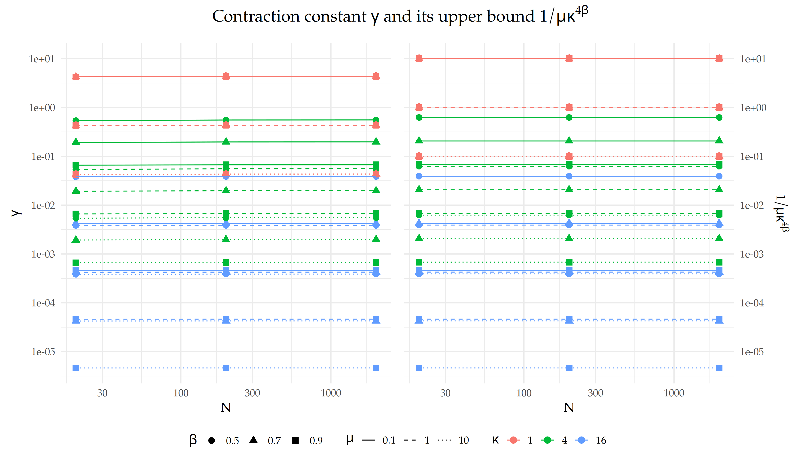
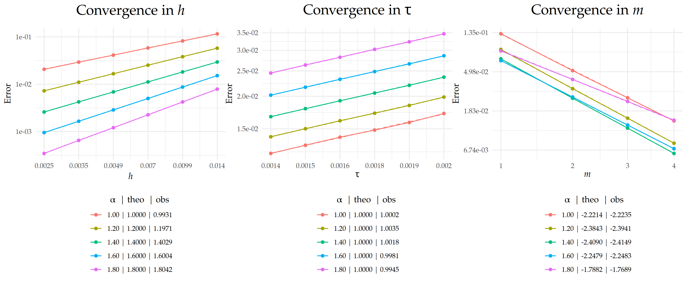
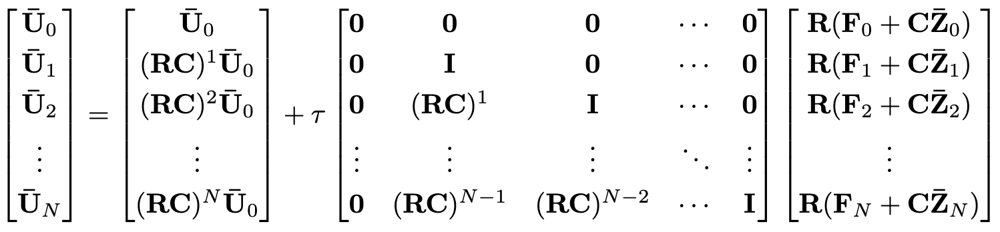
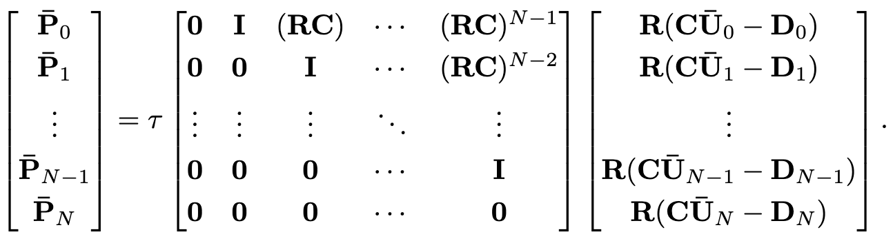
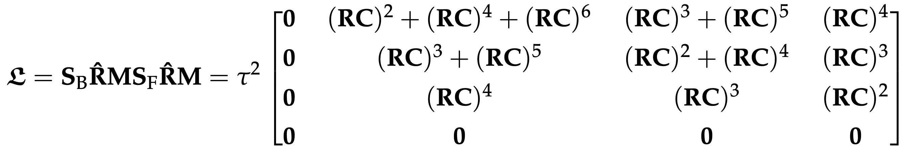
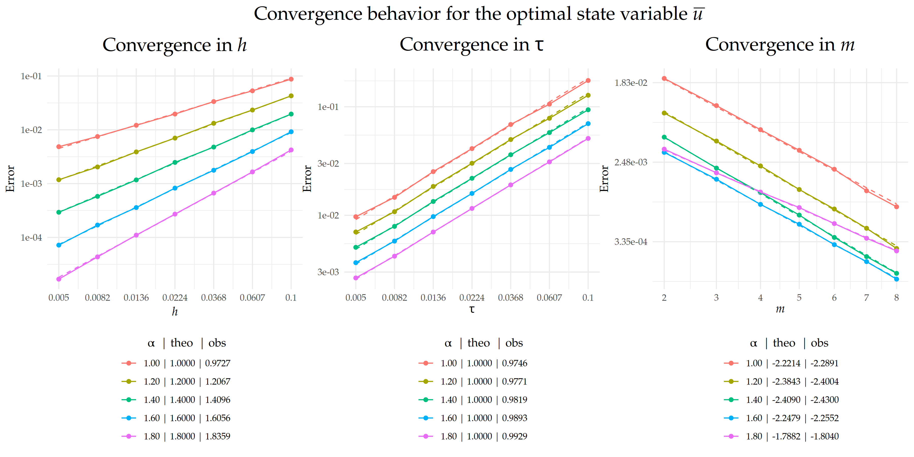
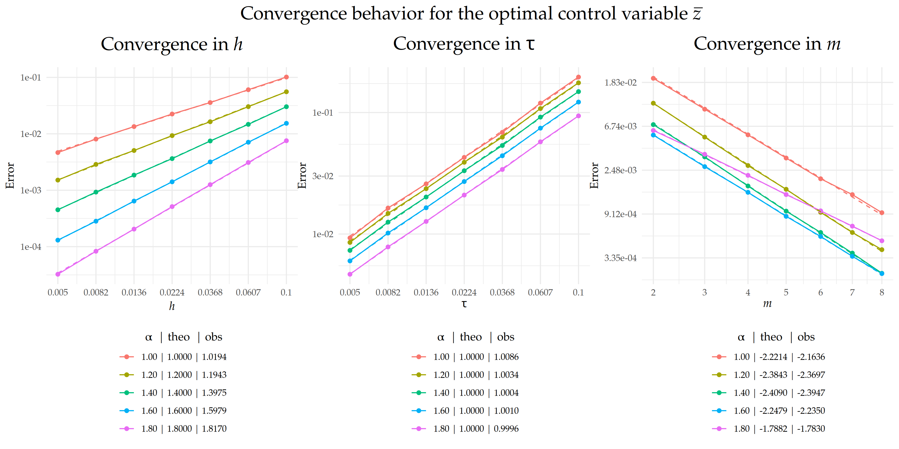

```{r, load_refs, include=FALSE, cache=FALSE}
library(RefManageR)
BibOptions(check.entries = FALSE,
           bib.style = "authoryear",
           cite.style = "alphabetic",
           style = "markdown",
           hyperlink = FALSE,
           dashed = FALSE)
myBib <- ReadBib("./presentation_ref.bib", check = FALSE)
```

```{r setup, echo = FALSE}
options(htmltools.dir.version = FALSE)
library(xaringanthemer)
style_mono_accent(base_color = "#0D2244")
htmltools::tagList(
  xaringanExtra::use_clipboard(
    button_text = "<i class=\"fa-solid fa-clipboard\" style=\"color: #00008B\"></i>",
    success_text = "<i class=\"fa fa-check\" style=\"color: #90BE6D\"></i>",
    error_text = "<i class=\"fa fa-times-circle\" style=\"color: #F94144\"></i>"
  ),
  rmarkdown::html_dependency_font_awesome()
)
knitr::opts_chunk$set(
  message = FALSE,    
  warning = FALSE,    
  echo = FALSE,        
  include = TRUE,     
  eval = TRUE,       
  cache = FALSE,       
  fig.align = "center",
  out.width = "90%",
  dpi = 300,
  error = TRUE,
  collapse = TRUE
)

fig_count <- 0
# Define the captioner function
captioner <- function(caption) {
  fig_count <<- fig_count + 1
  paste0("Figure ", fig_count, ": ", caption)
}
```


class: center, middle

<!-- <div style="position:absolute; top:40px; right:55px;"> -->
<!--    -->
<!-- </div> -->

<div style="position:absolute; top:40px; right:55px;">
  
  
  
</div>


# Part I


#### Numerical Analysis

---

class: left, top

<div style="position:absolute; top:40px; right:55px;">
  
  
  
</div>

### Problem setting
*********

We analyze and numerically approximate solutions to fractional diffusion equations on metric graphs of the form

.content-box-gray[
$$
\begin{cases}
  \partial_t u(s,t) + (\kappa^2 - \Delta_\Gamma)^{\alpha/2} u(s,t) & = f(s,t), \quad (s,t) \in \Gamma \times (0, T), \\
  u(s,0) & = u_0(s), \quad s \in \Gamma,
\end{cases}
\tag{1}
$$
]

with $u(\cdot,t)$ satisfying the Kirchhoff vertex conditions

\begin{equation}
\label{eq:Kcondfirstpart}
\tag{2}
   \mathcal{K} =  \left\{\phi\in C(\Gamma)\;\middle|\; \forall v\in \mathcal{V}:\;  \sum_{e\in\mathcal{E}_v}\partial_e \phi(v)=0 \right\}.
\end{equation}

Here $\Gamma = (\mathcal{V},\mathcal{E})$ is a compact metric graph, $\kappa>0$, $\alpha\in(0,2]$ determines the smoothness of $u(\cdot,t)$, $\Delta_{\Gamma}$ is the so-called Kirchhoff-Laplacian.

---

class: left, top

<div style="position:absolute; top:40px; right:55px;">
  
  
  
</div>

### Problem setting
*********

- For $\kappa>0$, we define the operator $L:D(L) = D(\Delta_{\Gamma})\to L_2(\Gamma)$ as the shifted Kirchhoff-Laplacian $L =\kappa^2 -\Delta_{\Gamma}$, which is densely-defined in $L_2(\Gamma)$, selfadjoint, and positive definite with a compact inverse, ensuring a well-posed spectral decomposition `r Cite(myBib, "berkolaiko2013introduction", "bolin2024gaussian")`.

- The fractional operator $L^{\alpha/2} : D(L^{\alpha/2}) \longmapsto L_2(\Gamma)$ is defined via
\begin{equation}
\label{lfractional}
\phi \longmapsto L^{\alpha/2}\phi = \sum_{j\in\mathbb{N}}\lambda_j^{\alpha/2}(\phi, e_j)_{L_2(\Gamma)}e_j
\end{equation}
and $-L^{\alpha/2}$ generates (see `r Cite(myBib, "Henry1981")`)
\begin{equation}
\label{Tsemigroup}
T(t)\phi = \sum_{j\in\mathbb{N}}e^{-\lambda^{\alpha/2}_jt}\left(\phi, e_j\right)_{L_2(\Gamma)}e_j.\tag{3}
\end{equation}

---

class: left, top

<div style="position:absolute; top:40px; right:55px;">
  
  
  
</div>

## Existence and uniqueness
*********

We interpret $(1)$ as an abstract Cauchy problem in $L_2(\Gamma)$, given by

.content-box-gray[
$$
\begin{cases}
    \partial_tu(t)+L^{\alpha/2}u(t)=f(t),\quad t\in (0, T),\\  
    u(0)=u_0\in D(L^{\alpha/2}).
\end{cases}
\tag{4}
$$
]


<div class="content-box-myblue">
Theorem 1
</div>

.content-box-gray[
If $f\in L_2(\Gamma\times(0,T))$  and $u_0\in \dot{H}^{\alpha}(\Gamma)$, then $(4)$ has a unique mild solution given by the variation of parameters formula
\begin{equation}
\label{solbyvarform}
u(t) = T(t)u_0 + \int_0^t T(t-r)f(r)dr,\quad t\geq 0.\tag{5}
\end{equation}
]

---

class: left, top

<div style="position:absolute; top:40px; right:55px;">
  
  
  
</div>

## Discretization | Space
*********


```{r, eval = FALSE, echo=FALSE, fig.align='center', fig.cap=captioner("Illustration of the basis function system $\\{\\psi^i_h\\}_{i=1}^{N_h}$ on the hat-basis-functions graph (in black). Standard hat functions associated with internal edge nodes are shown in blue, while special vertex-centered functions are highlighted in red. The star-shaped structures around the vertices are shown in green."), out.width='60%'}
# figures

```


```{r, eval =TRUE, fig.height = 1.8, out.width = "100%", fig.cap = captioner("Animation.")}
load(here::here("data_files/p_bridge.RData"))
p_bridge
```


---

class: left, top

<div style="position:absolute; top:40px; right:55px;">
  
  
  
</div>

## Discretization | Space
*********


```{r, eval =TRUE, fig.height = 1.8, out.width = "100%", fig.cap = captioner("Animation.")}
load(here::here("data_files/p_boundaryless.RData"))
p_boundaryless
```

---

class: left, top

<div style="position:absolute; top:40px; right:55px;">
  
  
  
</div>

## Discretization | Time
*********

- Backward Euler scheme

- To discretize the time domain, we divide the interval $[0, T]$ into $N$ uniform subintervals with time steps $t_k = k\tau,\; k = 0, \dots, N$, where $\tau = T/N$ is the time step size. 

- For a function $\phi$, we denote its value at $t_k$ by $\phi^k=\phi(t_k)$ and let $\phi^\tau$ denote the sequence of evaluations $\{\phi^k\}_{k=0}^N$ at the time step sequence $\{t_k\}_{k=0}^N$. 

- For any sequence $\phi^\tau$, we let $\tilde{\phi}^\tau$ represent the piecewise constant function given by

$$
\begin{cases}
 \tilde{\phi}^\tau(0) = \phi^0\\
\tilde{\phi}^\tau(t) = \phi^k,\quad t\in(t_{k-1},t_k],\quad k=1,\dots, N.
\end{cases}
$$


---

class: left, top

<div style="position:absolute; top:40px; right:55px;">
  
  
  
</div>

## Discrete Operator
*********

<div class="content-box-myblue">
Definition 1
</div>

.content-box-gray[
For $\alpha\in[0,2]$, we define the discrete version of $L^{\alpha/2}$ as $L_h^{\alpha/2}:V_h\to V_h$ via 
$$(L_h^{\alpha/2}\phi_h,\psi_h)_{L_2(\Gamma)} = \mathfrak{a}(\phi_h, \psi_h),\quad \phi_h,\psi_h\in V_h,\tag{6}$$ where the bilinear form $\mathfrak{a}:\dot{H}^{\alpha/2}(\Gamma)\times \dot{H}^{\alpha/2}(\Gamma)\to \mathbb{R}$ is defined by
$$\mathfrak{a}(\phi,\psi) := (L^{\alpha/4}\phi,L^{\alpha/4}\psi)_{L_2(\Gamma)}, \quad \phi,\psi\in\dot{H}^{\alpha/2}(\Gamma).$$
]

**Weak form of $(1)$**: Find $u$ such that
$$
\begin{cases}
    \langle\partial_tu,\phi\rangle + \mathfrak{a}(u,\phi) &= \langle f,\phi\rangle,\quad\forall \phi\in \dot{H}^{\alpha/2}(\Gamma),\quad \text{a.e. } t\in(0,T),\\  
    u(0)&=u_0.
\end{cases}
\tag{7}
$$

---

class: left, top

<div style="position:absolute; top:40px; right:55px;">
  
  
  
</div>

## Approximation | time-level
*********

Let $\alpha>0$ and $U^\tau$ denote the sequence of approximations of the solution to problem $(7)$ at each time step. That is, $U^{\tau}\subset\dot{H}^{\alpha/2}(\Gamma)$ solves
$$
\begin{cases}
    \langle\delta U^{k+1},\phi\rangle + \mathfrak{a}(U^{k+1},\phi)  &= \langle f^{k+1},\phi\rangle , \quad\forall\phi\in \dot{H}^{\alpha/2}(\Gamma),\quad k=0,\dots, N-1, \\
    U^0 &= u_0.
\end{cases}
\tag{8}
$$

<div class="content-box-myblue">
Theorem 2
</div>

.content-box-gray[
Let $\alpha>0$ and $u$ be the solution to $(7)$. Let $\tilde{U}^\tau$ be the piecewise constant function constructed from the solution to $(8)$. If $f\in L_\infty(\Gamma\times(0,T))$ and $u_0\in\dot{H}^{\alpha/2}(\Gamma)$, then
$$\|u-\tilde{U}^\tau\|_{L_2(\Gamma\times(0,T))}\lesssim \tau \left(\|u_0\|_{\dot{H}^{\alpha/2}(\Gamma)}+\|f\|_{L_\infty(\Gamma\times(0,T))}\right).$$
]

---

class: left, top

<div style="position:absolute; top:40px; right:55px;">
  
  
  
</div>

## Approximation | space-level
*********


Let $\alpha\in(0,2]$ and $U_h^\tau$ denote the sequence of approximations of the solution to problem $(7)$ at each time step on a mesh indexed by $h$. That is, $U_h^{\tau}\subset V_h$ solves
$$
\begin{cases}
    \langle\delta U_h^{k+1},\phi\rangle + \mathfrak{a}(
        U_h^{k+1},\phi) &= \langle f^{k+1},\phi\rangle, \quad\forall\phi\in V_h,\quad k=0,\dots, N-1, \\
    U^0_h &= P_hu_0, 
\end{cases}
\tag{9}
$$

<div class="content-box-myblue">
Theorem 3
</div>

.content-box-gray[
Let $\alpha\in[0,2]$ and $U^\tau$ and $U_h^\tau$ be the solutions to $(8)$ and $(9)$, respectively. If $f\in L_2(\Gamma\times(0,T))$ and $u_0\in\dot{H}^{\alpha}(\Gamma)$, then
$$\|U^\tau-U_h^\tau\|_{\ell^2(L_2(\Gamma))}\lesssim h^{\alpha}\left(\|u_0\|_{\dot{H}^{\alpha}(\Gamma)} + \|f^\tau\|_{\ell^2(L_2(\Gamma))}\right).$$
]


---

class: left, top

<div style="position:absolute; top:40px; right:55px;">
  
  
  
</div>

## Approximation | rational approx-level | 1
*********

The corresponding strong form of $(9)$ is given by
$$(I_{V_h}+\tau (\kappa^{2})^{\alpha/2}(L_h/\kappa^2)^{\alpha/2})U_h^{k+1} = U_h^{k}+\tau f^{k+1}.\tag{10}$$
Let $\beta = \alpha/2$. Applying $(L_h/\kappa^2)^{-\beta}$ to $(10)$ yields 
$$((L_h/\kappa^2)^{-\beta}+\tau \kappa^{2\beta} I_{V_h})U_h^{k+1}=(L_h/\kappa^2)^{-\beta}(U_h^{k}+\tau f^{k+1}).\tag{11}$$
.content-box-gray[
We now consider a rational approximation of $(L_h/\kappa^2)^{-\beta}$ of the form 
$$r_m((L_h/\kappa^2)^{-1})= p_\ell(L_h/\kappa^2)^{-1}p_r(L_h/\kappa^2).\tag{12}$$
]


---

class: left, top

<div style="position:absolute; top:40px; right:55px;">
  
  
  
</div>

## Approximation | rational approx-level | 2
*********

Replacing the rational approximation of $(L_h/\kappa^2)^{-\beta}$ in $(11)$ yields 
$$(r_m((L_h/\kappa^2)^{-1})+\tau \kappa^{2\beta} I_{V_h})U_{h,m}^{k+1}=r_m((L_h/\kappa^2)^{-1})(U_{h,m}^{k}+\tau f^{k+1}),\tag{13}$$
where the subindex $m$ indicates the dependence of the solution on the degree of the rational approximation.


<div class="content-box-myblue">
Theorem 4
</div>

.content-box-gray[
Let $\alpha\in[0,2]$ and $u$ be the solution to $(7)$. Assume further that for $k=0,\dots,N-1$, $U^{k+1}_{h,m}\in V_h$ solves the weak form of $(13)$ with $U^{0}_{h,m}= U^{0}_{h}$. If $f\in L_\infty(\Gamma\times(0,T))$ and $u_0\in\dot{H}^{\alpha}(\Gamma)$, then
$$\|u-U_{h,m}^\tau\|_{L_2(\Gamma\times(0,T))}\lesssim\tau+h^\alpha + h^{\alpha-2}e^{-2\pi\sqrt{(1-\alpha/2)m}},\tag{14}$$
where the hidden constant depends on $\|u_0\|_{L_2(\Gamma)} +\|f\|_{L_\infty(\Gamma\times(0,T))}$.
]

---

class: left, top

<div style="position:absolute; top:40px; right:55px;">
  
  
  
</div>

## Matrix representation | 1
*********


To derive the matrix representation of the numerical scheme, we first use $(12)$ to rewrite $(13)$ as
$$(p_r(L_h/\kappa^2)+\tau \kappa^{2\beta}p_\ell(L_h/\kappa^2))U_{h,m}^{k+1}= p_r(L_h/\kappa^2) (U_{h,m}^{k}+\tau f^{k+1}).\tag{15}$$
We can now go one step further and isolate the numerical solution at time $t_{k+1}$ by consider the following partial fraction decomposition 
$$\dfrac{p_r(x)}{p_r(x)+\tau \kappa^{2\beta}p_\ell(x)} =  \sum_{k=1}^{m+1}a_k(x-p_k)^{-1} + r,\tag{16}$$
where $\{a_k\}_{k=1}^{m+1}$ and $\{p_k\}_{k=1}^{m+1}$ are the residues and poles, respectively, and $r$ denotes the remainder. Substituting this into $(15)$ gives the iteration rule
$$U_{h,m}^{k+1}= \left(\sum_{k=1}^{m+1}a_k(L_h/\kappa^2-p_kI_{V_h})^{-1} + rI_{V_h}\right) (U_{h,m}^{k}+\tau f^{k+1}).\tag{17}$$


---

class: left, top

<div style="position:absolute; top:40px; right:55px;">
  
  
  
</div>

## Matrix representation | 2
*********


Substituting the expansion $U_h^k(s) =  \sum_{i=1}^{N_h}u_i^k\psi^i_h(s)$, $s\in\Gamma$ into the weak form $(17)$ yields the following matrix iteration
$$\mathbf{U}_{k+1} = \mathbf{C}^{-1}\left(\sum_{k=1}^{m+1} a_k\left(\mathbf{L}\mathbf{C}^{-1}/\kappa^2-p_k\mathbf{I}_{N_h}\right)^{-1} + r\mathbf{I}_{N_h}\right) (\mathbf{C}\mathbf{U}_k+\tau \mathbf{F}_{k+1}),\tag{18}$$
where $\mathbf{L} = \kappa^2\mathbf{C}+\mathbf{G}$, the matrix $\mathbf{C}\in\mathbb{R}^{N_h\times N_h}$ has entries $\mathbf{C}_{i,j} = (\psi^i_h,\psi^j_h)_{L_2(\Gamma)}$, $\mathbf{G}\in\mathbb{R}^{N_h\times N_h}$ has entries $\mathbf{G}_{i,j} = ({\psi^{i}_h}',{\psi^{j}_h}')_{L_2(\Gamma)}$, $\mathbf{U}_k\in\mathbb{R}^{N_h}$ has entries $u_i^k$, and $\mathbf{F}_k\in\mathbb{R}^{N_h}$ has components $(f^{k},\psi^i_h)_{L_2(\Gamma)}$. 

In practice, since the rational function in $(16)$ is proper, there is no remainder $r$. Moreover, since $( \mathbf{L}\mathbf{C}^{-1}/\kappa^2-p_k\mathbf{I}_{N_h})^{-1}  = \mathbf{C}(\mathbf{L}/\kappa^2-p_k\mathbf{C})^{-1}$, iteration $(18)$ reduces to
$$\mathbf{U}_{k+1} = \mathbf{R}(\mathbf{C}\mathbf{U}_k+\tau \mathbf{F}_{k+1}),\quad \mathbf{R} = \sum_{k=1}^{m+1} a_k\left(\mathbf{L}/\kappa^2-p_k\mathbf{C}\right)^{-1},\tag{19}$$
where it is evident that only sparse solves are required.

---

class: left, top

<div style="position:absolute; top:40px; right:55px;">
  
  
  
</div>

## Numerical experiments | 1
*********

Using the spectral representation $(3)$ of the semigroup $T(t)$, the solution $(5)$ of problem $(4)$ can be expressed as

.content-box-gray[
$$u(s,t) = \displaystyle\sum_{j\in\mathbb{N}}\text{e}^{-\lambda^{\alpha/2}_jt}\left(u_0, e_j\right)_{L_2(\Gamma)}e_j(s) + \int_0^t \displaystyle\sum_{j\in\mathbb{N}}\text{e}^{-\lambda^{\alpha/2}_j(t-r)}\left(f(r), e_j\right)_{L_2(\Gamma)}e_j(s)dr.$$
]

- Choose $\{x_j\}_{j=1}^{\infty}$ and set $u_0(s) = \sum_{j=1}^{\infty}x_je_j(s)$.
- Choose a scalar function $g(t)$ and coefficients $\{y_j\}_{j=1}^{\infty}$ and let $f(s,t) = g(t)\sum_{j=1}^{\infty} y_j e_j(s)$.
 
-  The exact solution is then given by

.content-box-gray[
$$ u(s,t) = \sum_{j=1}^{\infty}(x_j+y_j G_j(t))\text{e}^{-\lambda^{\alpha/2}_jt}e_j(s),\quad G_j(t)= \int_0^t \text{e}^{\lambda^{\alpha/2}_jr}g(r)dr.$$
]

---

class: left, top

<div style="position:absolute; top:40px; right:55px;">
  
  
  
</div>

## Numerical experiments | 2
*********

```{r, fig.height = 1.5, out.width = "100%", fig.cap = captioner("Comparison of the exact and approximate solution at selected time points.")}
library(plotly)
load(file = "data_files/exp1_com.RData")
exp1_com
```

---

class: left, top

<div style="position:absolute; top:40px; right:55px;">
  
  
  
</div>

## Convergence behavior | Calibration
*********

From Theorem 4, recall that the total error satisfies
$$\|u-U_{h,m}^\tau\|_{L_2(\Gamma\times(0,T))}\lesssim\tau+h^\alpha + h^{\alpha-2}e^{-2\pi\sqrt{(1-\alpha/2)m}}.$$

To observe the convergence behavior with respect to $\tau$, $h$, and $m$, we need to calibrate the discretization parameters. That essentially means that we set
$$\tau = h^\alpha = h^{\alpha-2}e^{-2\pi\sqrt{(1-\alpha/2)m}}$$
and solve for the other two parameters when the other is the one of interest.

**Example**: Convergence with respect to $h$.

- For a given $h$, set $\tau = h^\alpha$ and $m = \lceil\log_{\text{e}}^2(h)/(\pi^2(1-\alpha/2))\rceil$.

Therefore.

$$\|u-U_{h,m}^\tau\|_{L_2(\Gamma\times(0,T))}\lesssim C_h h^\alpha.$$


---

class: left, top

<div style="position:absolute; top:40px; right:55px;">
  
  
  
</div>

## Convergence behavior | Results
*********


      
```{r, echo = FALSE, fig.align='center', fig.dim= c(12,6), fig.cap = captioner("Comparison between theoretical and observed convergence behavior for the error $\\|u-U_{h,m}^\\tau\\|_{L_2(\\Gamma\\times(0,T))}$.")}

```


---

class: center, middle

<div style="position:absolute; top:40px; right:55px;">
  
  
  
</div>


# Part II

#### Optimal Control

---

class: left, top

<div style="position:absolute; top:40px; right:55px;">
  
  
  
</div>

## Problem setting
*********

Let $u_d$ be the desired state, $z$ denote the control variable, and  $\mu>0$ a regularization parameter. We are concerned with the following PDE-constrained optimization problem: Find
$$\min\; J(u, z),\quad J(u, z)=  \frac{1}{2}\int_0^T\left(\left\|u-u_d\right\|_{L_2(\Gamma)}^2+\mu\|z\|_{L_2(\Gamma)}^2\right) dt\tag{20}$$
subject to the fractional diffusion equation 

.content-box-gray[
$$
\begin{cases}
\partial_t u(s,t) + (\kappa^2 - \Delta_\Gamma)^{\alpha/2} u(s,t) & = f(s,t)+z(s,t), \quad (s,t) \in \Gamma \times (0, T), \\
u(s,0) & = u_0(s), \quad s \in \Gamma,
\end{cases}
\tag{21}
$$
]

where $u$ satisfies the Kirchhoff vertex conditions \eqref{eq:Kcondfirstpart}, and $z$ satisfies the control constraints 
\begin{align}
\label{control_constraints}
\tag{22}
    a(s,t)\leq z(s,t)\leq b(s,t)\quad\text{ a.e. } (s,t)\in\Gamma \times(0, T).
\end{align}


---

class: left, top

<div style="position:absolute; top:40px; right:55px;">
  
  
  
</div>

## Adjoint state
*********


The solution $p=p(z)$ of

.content-box-gray[
$$
\begin{cases}
    -\partial_t p(s,t) + (\kappa^2 - \Delta_\Gamma)^{\alpha/2} p(s,t) &= u(s,t)-u_d(s,t),  \quad (s,t) \in \Gamma \times (0, T), \\
    p(s,T) &= 0,  \quad s \in \Gamma,
\end{cases}
\tag{23}
$$
]

is called the fractional adjoint state associated to $u = u(z)$


---

class: left, top

<div style="position:absolute; top:40px; right:55px;">
  
  
  
</div>

## Projection formula
*********

The optimal control variable $\bar{z}$ is related to the optimal adjoint state $\bar{p}$ via the projection formula `r Cite(myBib, "Troltzsch2025optimal")`.
\begin{align}
\tag{24}
\label{proj_formula}
    \bar{z}  = \min\left\{b ,\max\left\{a ,-\bar{p}/\mu \right\}\right\}.
\end{align}

We rely in the following result.

<div class="content-box-myblue">
Lemma
</div>

.content-box-gray[
A triple $(u, p, z)$ is optimal for $(20)$ - $(22)$ if and only if $u$ and $p$ satisfy the state and adjoint equations, respectively, and $z$ satisfies \eqref{proj_formula}.
]


---

class: left, top

<div style="position:absolute; top:40px; right:55px;">
  
  
  
</div>

## Error estimates
*********

<div class="content-box-myblue">
Theorem 5
</div>

.content-box-gray[
Let $\alpha\in[0,2]$ and $\bar{u}$ be the solution to $(21)$ corresponding to the optimal control $\bar{z}$ of $(20)$ - $(22)$. Let $\bar{U}_{h,m}^\tau$ denote the piecewise linear approximation of the optimal discrete state obtained from the discrete scheme after the rational approximation. Let $\bar{Z}_{h,m}^\tau$ denote the corresponding piecewise constant approximation of the optimal discrete control. If $f,u_d\in L_2((0,T);\dot{H}^\beta(\Gamma)) \cap L_\infty(\Gamma\times(0,T))$ for $\beta<1$ and $u_0\in\dot{H}^{\alpha}(\Gamma)$ , then

$$\|\bar{u}-\bar{U}_{h,m}^\tau\|_{L_2(\Gamma\times(0,T))}\lesssim\tau+h^\alpha + h^{\alpha-2}e^{-2\pi\sqrt{(1-\alpha/2)m}}$$

and

$$\|\bar{z}-\bar{Z}_{h,m}^\tau\|_{L_2(\Gamma\times(0,T))}\lesssim\tau+h^\alpha + h^{\alpha-2}e^{-2\pi\sqrt{(1-\alpha/2)m}}.$$
]


---

class: left, top

<div style="position:absolute; top:40px; right:55px;">
  
  
  
</div>

## Forward-backward sweep method
*********

At a high level, FBSM follows these steps.

a. *Initialization:* Choose an initial approximation for $\bar{z}$. 

b. *State solve:* Using $\bar{z}$, solve $(21)$ to obtain $\bar{u}$. 

c. *Adjoint solve:* Using $\bar{u}$, solve $(23)$ to obtain $\bar{p}$. 

d. *Control update:* Update $\bar{z}$ via the projection formula \eqref{proj_formula}. 

e. *Iteration:* Repeat steps b - d until convergence. 

---

class: left, top

<div style="position:absolute; top:40px; right:55px;">
  
  
  
</div>

## Fully discrete FBSM
*********

1 *Initialization:* Initialize $\mathbf{\bar{Z}}\in \mathbb{R}^{N_{h}\times (N+1)}$.

2 *State solve:* Given $\mathbf{\bar{Z}}$, compute $\mathbf{\bar{U}}\in \mathbb{R}^{N_{h}\times (N+1)}$ with the iteration

$$
\begin{cases}
  \mathbf{\bar{U}}_{k+1}  &= \mathbf{R}\mathbf{C}\mathbf{\bar{U}}_k+\tau \mathbf{R}(\mathbf{F}_{k+1}+\mathbf{C}\mathbf{\bar{Z}}_{k+1}),\quad k = 0,\dots, N-1,\\
    \mathbf{\bar{U}}_{0} & = [u_0(s_1), \dots, u_0(s_{N_h})]^\top.
\end{cases}
\tag{25}
$$

3 *Adjoint solve:* Given $\mathbf{\bar{U}}$ from Step 2, compute $\mathbf{\bar{P}}\in \mathbb{R}^{N_{h}\times (N+1)}$ with the iteration
$$
\begin{cases}
    \mathbf{\bar{P}}_{k} & = \mathbf{R}\mathbf{C}\mathbf{\bar{P}}_{k+1}+\tau \mathbf{R}(\mathbf{C}\mathbf{\bar{U}}_{k+1}-\mathbf{D}_{k+1}),\quad k = N-1,\dots, 0,\\
    \mathbf{\bar{P}}_{N} & = \mathbf{0}.
\end{cases}
\tag{26}
$$


4 *Control update:* Given $\mathbf{\bar{P}}$ from Step 3, update 
$$\mathbf{\bar{Z}} = \max\{\mathbf{A},\min\{\mathbf{B},-\mathbf{\bar{P}}/\mu\}\}\quad \text{(entry-wise)}.$$

5 *Iteration:* Repeat steps 2-4 until convergence.


---

class: left, top

<div style="position:absolute; top:40px; right:55px;">
  
  
  
</div>

## Convergence analysis of the FBSM
*********

The unfolded iterations in $(25)$ and $(26)$ can equivalently be written in block-matrix form as


```{r, echo=FALSE, fig.align='center', out.width='70%'}
# figures

```

and 

```{r, echo=FALSE, fig.align='center', out.width='60%'}
# figures

```

---

class: left, top

<div style="position:absolute; top:40px; right:55px;">
  
  
  
</div>

## Matrix vs Vector form
*********


$$
\begin{cases}
    (1) \text{ Initialize } \mathbf{\bar{Z}},\\
    (2) \text{ Compute }\mathbf{\bar{U}} \text{ by }\mathbf{\bar{U}}_{k+1}  = \mathbf{R}(\mathbf{C}\mathbf{\bar{U}}_k+\tau (\mathbf{F}_{k+1}+\mathbf{C} \mathbf{\bar{Z}}_{k+1})),\\
    (3)\text{ Compute }\mathbf{\bar{P}}\text{ by }\mathbf{\bar{P}}_{k}  = \mathbf{R}(\mathbf{C}\mathbf{\bar{P}}_{k+1}+\tau (\mathbf{C} \mathbf{\bar{U}}_{k+1}-\mathbf{D}_{k+1})),\\
    (4)\text{ Update } \mathbf{\bar{Z}} = \max\{\mathbf{A},\min\{\mathbf{B},-\mathbf{\bar{P}}/\mu\}\},\\
    (5)\text{ Repeat }(2) - (4) \text{ until convergence},
\end{cases}
\quad
\begin{cases}
     (1) \text{ Initialize } \mathbf{\bar{z}},\\
    (2) \text{ Compute }\mathbf{\bar{u}} = \mathbf{h} + \mathbf{S}_{\mathrm{F}}\mathbf{\hat{R}}(\mathbf{f}+\mathbf{M}\mathbf{\bar{z}}),\\
    (3) \text{ Compute }\mathbf{\bar{p}}  = \mathbf{S}_{\mathrm{B}}\mathbf{\hat{R}}(\mathbf{M}\mathbf{\bar{u}} - \mathbf{d}),\\
    (4)\text{ Update }\mathbf{\bar{z}}  = \max\{\mathbf{a}, \min\{\mathbf{b}, -\mathbf{\bar{p}}/\mu\}\},\\
    (5)\text{ Repeat }(2) - (4) \text{ until convergence},
\end{cases}
$$

where

\begin{align*}
 \mathbf{\bar{u}} = \text{vec}(\mathbf{\bar{U}}),\quad 
\mathbf{\bar{p}} = \text{vec}(\mathbf{\bar{P}}),\quad
\mathbf{\bar{z}} = \text{vec}(\mathbf{\bar{Z}}),\quad \mathbf{f} = \text{vec}(\mathbf{F}),\quad
\mathbf{d} =\text{vec}(\mathbf{D}), 
\end{align*}

\begin{align*}
\mathbf{a} =\text{vec}(\mathbf{A}),\quad
\mathbf{b} = \text{vec}(\mathbf{B}),\quad \mathbf{h}= [\mathbf{\bar{U}}_{0}^\top ((\mathbf{R}\mathbf{C})^{1}\mathbf{\bar{U}}_{0})^\top ((\mathbf{R}\mathbf{C})^{2} \mathbf{\bar{U}}_{0})^\top\dots ((\mathbf{R}\mathbf{C})^{N}\mathbf{\bar{U}}_{0})^\top]^\top,
\end{align*}
\begin{align*}
\mathbf{M} = \mathbf{I}_{N+1}\otimes  \mathbf{C},\quad \mathbf{\hat{J}}_{N+1} = \mathbf{J}_{N+1}\otimes \mathbf{I}_{N_h},\quad \mathbf{\hat{R}} = \mathbf{I}_{N+1}\otimes  \mathbf{R}.
\end{align*}


---

class: left, top

<div style="position:absolute; top:40px; right:55px;">
  
  
  
</div>

## Fixed-point iteration | 1
*********

**Vectorized formulation**

\begin{align*}
    \mathbf{\bar{z}}  =  \underbrace{\max\{\mathbf{a}, \min\{\mathbf{b}, -(\mathbf{S}_{\mathrm{B}}\mathbf{\hat{R}}\mathbf{M}\mathbf{h}+\mathbf{S}_{\mathrm{B}}\mathbf{\hat{R}}\mathbf{M}\mathbf{S}_{\mathrm{F}}\mathbf{\hat{R}}\mathbf{f}-\mathbf{S}_{\mathrm{B}}\mathbf{\hat{R}}\mathbf{d}+\mathbf{S}_{\mathrm{B}}\mathbf{\hat{R}}\mathbf{M}\mathbf{S}_{\mathrm{F}}\mathbf{\hat{R}}\mathbf{M}\mathbf{\bar{z}})/\mu\}\}}_{\mathfrak{T}(\mathbf{z})}.
\end{align*}
The vectorized formulation naturally induces the iterative scheme $\mathbf{\bar{z}}^{(n+1)}  = \mathfrak{T}(\mathbf{\bar{z}}^{(n)})$.

**Matrix formulation**

Define the matrix-level counterpart of $\mathfrak{T}$ as
\begin{align*}
  \mathcal{T}(\mathbf{X}) = \text{vec}^{-1}(\mathfrak{T}(\text{vec}(\mathbf{X}))) = \text{vec}^{-1}(\mathfrak{T}(\mathbf{x})).
\end{align*}
The corresponding iterative scheme then reads $\mathbf{\bar{Z}}^{(n+1)}  = \mathcal{T}(\mathbf{\bar{Z}}^{(n)})$.


---

class: left, top

<div style="position:absolute; top:40px; right:55px;">
  
  
  
</div>

## Fixed-point iteration | 2
*********
 
The quadrature-based norm, natural for the matrix formulation, and the weighted Euclidean norm, natural for the vectorized formulation, are equivalent up to the factor $\sqrt{\tau}$:
$$\|\mathbf{X}\|_{\mathfrak{q}}  = \sqrt{\tau}\|\mathbf{x}\|_{\mathbf{C}_{N+1}}.$$

 <div class="content-box-myblue">
Proposition 1
</div>

.content-box-gray[
If $\mu\kappa^{4\beta}>1$, then $\mathcal{T}$ is a contraction with respect to the $\|\cdot\|_{\mathfrak{q}}$ norm and $\mathfrak{T}$ is a contraction with respect to the $\mathbf{C}_{N+1}$-weighted norm, both with contraction constant $\gamma =  1/(\mu\kappa^{4\beta})$.
]

By the Banach fixed-point theorem, $(\mathbf{\bar{z}}^{(n)})_{n\in\mathbb{N}}$ converges to a unique fixed point $\mathbf{\bar{z}}^\star$, which uniquely determines the optimal state via $\mathbf{\bar{u}}^{\star} = \mathbf{h} + \mathbf{S}_{\mathrm{F}}\mathbf{\hat{R}}(\mathbf{f}+\mathbf{M}\mathbf{\bar{z}}^{\star})$.

---

class: left, top

<div style="position:absolute; top:40px; right:55px;">
  
  
  
</div>

## Idea of the proof 
*********
 
Let $\mathbf{X}, \mathbf{Y}\in\mathbb{R}^{N_h\times(N+1)}$ and $\mathbf{x} =\text{vec}(\mathbf{X}),\mathbf{y} = \text{vec}(\mathbf{Y})\in \mathbb{R}^{(N+1)N_h}$ be their vectorized forms. Then

\begin{align}
    \|\mathcal{T}(\mathbf{X}) - \mathcal{T}(\mathbf{Y})\|_{\mathfrak{q}} & =  \|\text{vec}^{-1}(\mathfrak{T}(\mathbf{x})) - \text{vec}^{-1}(\mathfrak{T}(\mathbf{y}))\|_{\mathfrak{q}}\\
    & =  \|\text{vec}^{-1}(\mathfrak{T}(\mathbf{x})-\mathfrak{T}(\mathbf{y}))\|_{\mathfrak{q}}\\
    & = \sqrt{\tau}\|\mathfrak{T}(\mathbf{x})-\mathfrak{T}(\mathbf{y})\|_{\mathbf{C}_{N+1}}.\label{Lip1}
\end{align}
From the Lipschitz property of the componentwise projection operator $\Pi(\mathbf{x}) := \max\{\mathbf{a}, \min\{\mathbf{b}, -\mathbf{x}/\mu\}\}$, we have
\begin{align}
    \|\mathfrak{T}(\mathbf{x})-\mathfrak{T}(\mathbf{y})\|_{\mathbf{C}_{N+1}} &\leq (1/\mu)\| \mathbf{S}_{\mathrm{B}}\mathbf{\hat{R}}\mathbf{M}\mathbf{S}_{\mathrm{F}}\mathbf{\hat{R}}\mathbf{M}\mathbf{x}-\mathbf{S}_{\mathrm{B}}\mathbf{\hat{R}}\mathbf{M}\mathbf{S}_{\mathrm{F}}\mathbf{\hat{R}}\mathbf{M}\mathbf{y}\|_{\mathbf{C}_{N+1}}\\
    &\leq (1/\mu)\| \mathbf{S}_{\mathrm{B}}\mathbf{\hat{R}}\mathbf{M}\mathbf{S}_{\mathrm{F}}\mathbf{\hat{R}}\mathbf{M}\|_{\mathbf{C}_{N+1}}\|\mathbf{x}-\mathbf{y}\|_{\mathbf{C}_{N+1}}\\
    &= \gamma\|\mathbf{x}-\mathbf{y}\|_{\mathbf{C}_{N+1}},\label{Lip2}
\end{align}
where $\gamma = (1/\mu)\|\boldsymbol{\mathfrak{L}}\|_{\mathbf{C}_{N+1}}$ and $\boldsymbol{\mathfrak{L}} = \mathbf{S}_{\mathrm{B}}\mathbf{\hat{R}}\mathbf{M}\mathbf{S}_{\mathrm{F}}\mathbf{\hat{R}}\mathbf{M}$.


---

class: left, top

<div style="position:absolute; top:40px; right:55px;">
  
  
  
</div>

## Example
*********

With $N=3$, matrix $\boldsymbol{\mathfrak{L}}$ has the form

```{r, echo=FALSE, fig.align='center', out.width='70%'}
# figures

```

Define a scalar matrix $\mathbf{T}$ as $\mathbf{T}  = \begin{bmatrix}\omega^2+\omega^4+\omega^6 & \omega^3+\omega^5 & \omega^4\\\omega^3+\omega^5 & \omega^2+\omega^4 & \omega^3\\\omega^4 & \omega^3 & \omega^2\\\end{bmatrix}$, where $\omega = \dfrac{1}{1+\tau\kappa^{2\beta}}<1.$

One can show that $\|\boldsymbol{\mathfrak{L}}\|_{\mathbf{C}_{N+1}} = \tau^2\|\mathbf{T}\|_2$ and $\|\mathbf{T}\|_2  \leq \dfrac{1}{\tau^2\kappa^{4\beta}}$. Consequently,
$$\gamma = \dfrac{1}{\mu}\|\boldsymbol{\mathfrak{L}}\|_{\mathbf{C}_{N+1}} =  \dfrac{\tau^2}{\mu}\|\mathbf{T}\|_2 \leq \dfrac{\tau^2}{\mu} \dfrac{1}{\tau^2\kappa^{4\beta}} = \dfrac{1}{\mu\kappa^{4\beta}}.$$

---

class: left, top

<div style="position:absolute; top:40px; right:55px;">
  
  
  
</div>

## Contraction constant
*********


```{r, echo=FALSE, fig.align='center', out.width='70%', fig.cap = captioner("Comparison between the contraction constant and its upper bound.")}
# figures

```

---

class: left, top

<div style="position:absolute; top:40px; right:55px;">
  
  
  
</div>

## Convergence behavior | 1
*********


```{r, echo = FALSE, fig.align='center', out.width='75%', fig.cap = captioner("Comparison between theoretical and observed convergence behavior for the error $\\|\\bar{u}-\\bar{U}_{h,m}^\\tau\\|_{L_2(\\Gamma\\times(0,T))}$.")}
# figures

```


---

class: left, top

<div style="position:absolute; top:40px; right:55px;">
  
  
  
</div>

## Convergence behavior | 2
*********


```{r, echo = FALSE, fig.align='center', out.width='75%', fig.cap = captioner("Comparison between theoretical and observed convergence behavior for the error $\\|\\bar{z}- \\bar{\\mathcal{Z}}_{h,m}^\\tau\\|_{L_2(\\Gamma\\times(0,T))}$.")}
# figures

```

---


class: left, top

<div style="position:absolute; top:40px; right:55px;">
  
  
  
</div>

## More information
*********

```{r, echo = FALSE, fig.align='center', out.width='25%', fig.cap = "Visit https://leninrafaelrierasegura.github.io/NAFDEMG/ for more information."}
library(qrcode)
# Generate QR code
myqrcode <- qr_code("https://leninrafaelrierasegura.github.io/NAFDEMG/about.html") 
plot(myqrcode)
```

---


class: left, top

<div style="position:absolute; top:40px; right:55px;">
  
  
  
</div>

## References
*********

```{r refs, echo=FALSE, results="asis"}
PrintBibliography(myBib, .opts = list(bib.style = "alphabetic"))
```


