```{r, load_refs, include=FALSE, cache=FALSE}
library(RefManageR)
BibOptions(check.entries = FALSE,
           bib.style = "authoryear",
           cite.style = "alphabetic",
           style = "markdown",
           hyperlink = FALSE,
           dashed = FALSE)
myBib <- ReadBib("./presentation_ref.bib", check = FALSE)
```

```{r setup, echo = FALSE}
options(htmltools.dir.version = FALSE)
library(xaringanthemer)
style_mono_accent(base_color = "#0D2244")
htmltools::tagList(
  xaringanExtra::use_clipboard(
    button_text = "<i class=\"fa-solid fa-clipboard\" style=\"color: #00008B\"></i>",
    success_text = "<i class=\"fa fa-check\" style=\"color: #90BE6D\"></i>",
    error_text = "<i class=\"fa fa-times-circle\" style=\"color: #F94144\"></i>"
  ),
  rmarkdown::html_dependency_font_awesome()
)
knitr::opts_chunk$set(
  message = FALSE,    
  warning = FALSE,    
  echo = FALSE,        
  include = TRUE,     
  eval = TRUE,       
  cache = FALSE,       
  fig.align = "center",
  out.width = "90%",
  dpi = 300,
  error = TRUE,
  collapse = TRUE
)

fig_count <- 0
# Define the captioner function
captioner <- function(caption) {
  fig_count <<- fig_count + 1
  paste0("Figure ", fig_count, ": ", caption)
}
```


class: left, top

<!-- <div style="position:absolute; top:40px; right:55px;"> -->
<!--    -->
<!-- </div> -->

<div style="position:absolute; top:40px; right:55px;">
  
  
  
</div>


### Outline
*********

### - Preliminaries 
### - Project 1
### - Project 2
### - Project 3
### - Project 4

---

class: center, middle

<div style="position:absolute; top:40px; right:55px;">
  
  
  
</div>


## Preliminaries

*********

# On metric graps, the SPDE approach, and the rational approximation

*********


---

class: left, top

<div style="position:absolute; top:40px; right:55px;">
  
  
  
</div>

### Preliminaries | Metric graphs | Definition
*********

.custom-box[
A metric graph $\Gamma$ is a combinatorial undirected graph $\Gamma = (\mathcal{V}, \mathcal{E})$ equipped with a metric $d(\cdot,\cdot)$, where 
- $\mathcal{V} = \{v\}$ denotes the vertex set with $\mathcal{V}\subset\mathbb{R}^n$ for some $n\in\mathbb{N}$, 

- $\mathcal{E} = \{e\}$ denotes the edge set where each $e$ is induced by a rectifiable curve $\gamma_e:[0,\ell_e]\to\mathbb{R}^d$, parametrized by arc-length, satisfying $e = \gamma_e([0,\ell_e])$ and $\operatorname{length}(\gamma_e) = \ell_e$, and

- $d(\cdot,\cdot)$ is the geodesic distance, defined as the length of the shortest path along the edges connecting two points.
]

---

class: left, top

<div style="position:absolute; top:40px; right:55px;">
  
  
  
</div>

### Preliminaries | Metric graphs | Example 1/3 (2D)
*********


```
{r, eval =TRUE, fig.height = 1.55, out.width = "100%", fig.cap = captioner("Animation.")}
load(here::here("data_files/p_from_graph_to_interval_transformation.RData"))
p_from_graph_to_interval_transformation
```

---

class: left, top

<div style="position:absolute; top:40px; right:55px;">
  
  
  
</div>

### Preliminaries | Metric graphs | Example 2/3 (3D)
*********


      
```{r, echo = FALSE, fig.align='center', out.width='99%', fig.cap = captioner("A graph (the spaghetti graph) embedded in \\(\\mathbb{R}^3\\) (left), its projection onto the plane (middle), and a zoomed-in view (right).")}
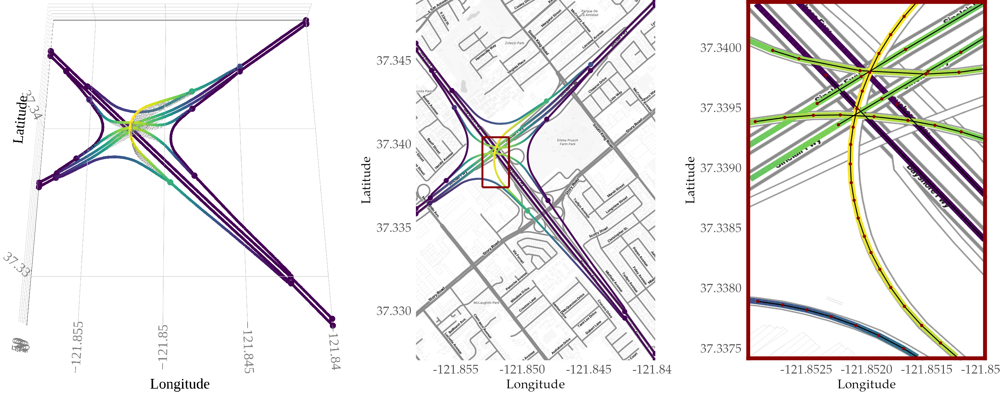
```


---

class: left, top

<div style="position:absolute; top:40px; right:55px;">
  
  
  
</div>

### Preliminaries | Metric graphs | Example 3/3 (3D)
*********


      
```{r, echo = FALSE, fig.align='center', out.width='80%', fig.cap = captioner("The \\(n\\)-sphere fully connected graph (left) and its planar projection onto the plane (right).")}
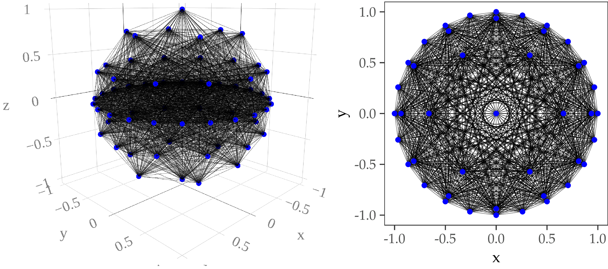
```


---

class: left, top

<div style="position:absolute; top:40px; right:55px;">
  
  
  
</div>

### Preliminaries | Metric graphs | Functions
*********

A real-valued function $f$ on $\Gamma$ is specified by a collection of functions $\{f_e\}_{e\in\mathcal{E}}$. For example, consider the function $f = \{f_{e_1},f_{e_2}\}$ given by
\begin{equation}
\label{eq:funct_to_discuss_something}
    \begin{cases}
        f_{e_1}(s) = e^{t/4},& s = (e_1,t),\;t\in[0,\ell_{e_1}],\\
        f_{e_2}(s) = \sin(3\pi t/\ell) + f_0 ,&  s = (e_2,t),\;t\in[0,\ell_{e_2}].
    \end{cases}
\end{equation}
      
```{r, echo = FALSE, fig.align='center', out.width='50%', fig.cap = captioner("Functions are first plotted on their corresponding intervals and then mapped back to the edges of the graph.")}
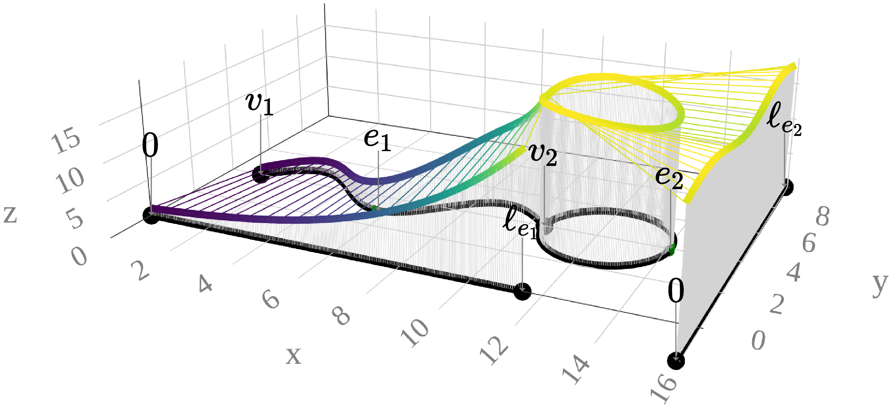
```


---

class: left, top

<div style="position:absolute; top:40px; right:55px;">
  
  
  
</div>

### Preliminaries | Metric graphs | Hat basis functions
*********


```{r, echo = FALSE, fig.align='center', out.width='60%', fig.cap = captioner("Finite element discretization of the tadpole graph, with the subdivision of each edge into regular segments and placement of nodes (left), and the corresponding system of basis functions \\(\\{\\varphi_j^e, \\phi_v\\}\\).")}
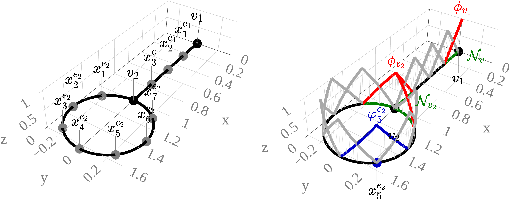
```


---

class: left, top

<div style="position:absolute; top:40px; right:55px;">
  
  
  
</div>

### Preliminaries | The SPDE approach
*********

.custom-box[
Key idea: To characterize a random field as the solution to a stochastic partial differential equation defined on the graph $\Gamma$ `r Cite(myBib, "Lindgren2011AnExplicit", "Bolin2024Gaussian")`.
]

To fix ideas, let $L = \kappa^2 - \Delta_{\Gamma}$, let $\alpha > 1/2$, and consider the SPDE
\begin{align}
\label{eq:spde_on_graphgamma}
    L^{\alpha/2}(\tau u) = \mathcal{W}, \quad\text{on }\Gamma.
\end{align}

We approximate $u$ by a finite element expansion $u_h(s) = \sum_{j=1}^{N_h} u_j \psi_j(s)$. For the special case $\tau = 1$ and $\alpha = 2$, this leads to the variational formulation
\begin{align}
\mathfrak{h}(u_h,\psi_i) = \mathcal{W}_h(\psi_i), \qquad i = 1,\dots,N_h,
\end{align}
which yields a linear system that, in matrix form, reads
\begin{align*}
(\mathbf{G} + \mathbf{C}^\kappa)\mathbf{u} = \mathbf{W}.
\end{align*}
It follows that $\mathbf{u}\sim N(\mathbf{0}, \mathbf{Q}_2^{-1})$, where $\mathbf{Q}_2=\mathbf{L}^\top\mathbf{C}^{-1}\mathbf{L}$ with $\mathbf{L}= \mathbf{G}+\mathbf{C}^\kappa$.


---

class: left, top

<div style="position:absolute; top:40px; right:55px;">
  
  
  
</div>

### Preliminaries | Sparsity pattern of FEM matrices
*********

```{r, echo = FALSE, fig.align='center', out.width='70%', fig.cap = captioner("Sparse pattern of the mass matrix \\(\\mathbf{C}\\) for the tadpole graph (left), and for the \\(n\\)-sphere graph (right). Nonzero entries are depicted as black pixels.")}
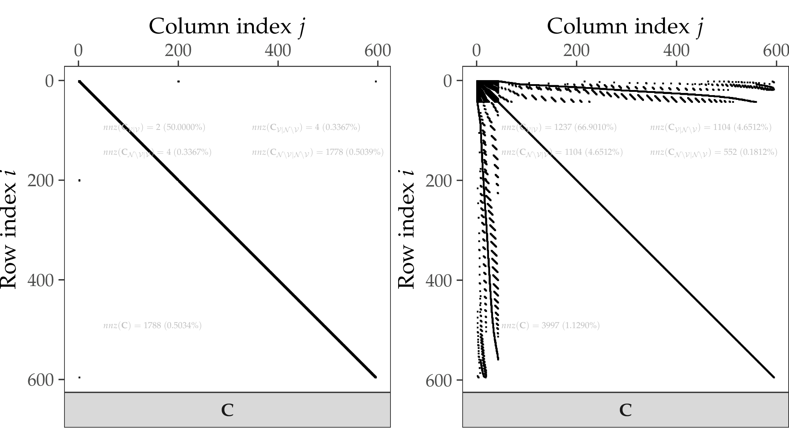
```


---

class: left, top

<div style="position:absolute; top:40px; right:55px;">
  
  
  
</div>

### Preliminaries | The rational approximation | 1 line summary
*********

.custom-box[
Let $\alpha>0$ and $\delta \in (0,1)$. In essence, the rational approximation consists in representing $x^{-\alpha}$ as
\begin{align}
\label{eq:partial_frac_approx_der}
\tag{1}
   x^{-\alpha} = x^{-\lfloor\alpha\rfloor}x^{-\{\alpha\}}\approx x^{-\lfloor\alpha\rfloor}\dfrac{p_m(x)}{q_m(x)} = x^{-\lfloor\alpha\rfloor}k+x^{-\lfloor\alpha\rfloor}\sum_{i=1}^mr_i(x-p_i)^{-1},\quad x\in[1,1/\delta],\quad x^{-1}\in[\delta,1],\quad
\end{align}
where $k,r_i>0$ and $p_i<0$ for $i=1,\dots,m$.
]

From `r Cite(myBib, "Stahl2003Best")`, we obtain the exponential convergence estimate
\begin{align}
    \label{eq:rational_error_with_one_over_delta}
    \sup_{x\in[1,1/\delta]}\left|x^{-\alpha} - r_m(x^{-1})\right| &\leq C \mathrm{e}^{-2\pi\sqrt{\{\alpha\}m}},
\end{align}
where $C$ is a constant independent of $m$ and $r_m(x^{-1}) = x^{-\lfloor\alpha\rfloor}k+x^{-\lfloor\alpha\rfloor}\sum_{i=1}^mr_i(x-p_i)^{-1}$.


---

class: left, top

<div style="position:absolute; top:40px; right:55px;">
  
  
  
</div>

### Preliminaries | The rational approximation | Convergence
*********


```{r, echo = FALSE, fig.align='center', out.width='90%', fig.cap = captioner("Comparison between the theoretical and observed convergence rates for the \\(L_{\\infty}([1, 1/\\delta_m])\\)-error of the rational approximation.")}
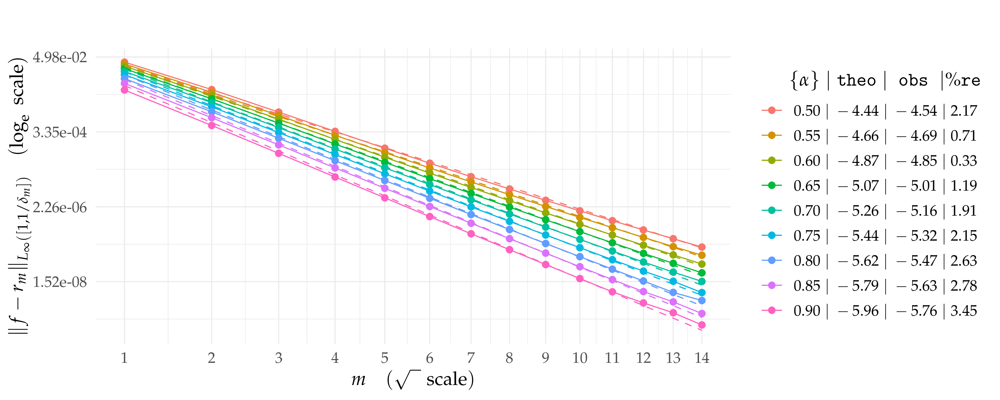
```


---

class: left, top

<div style="position:absolute; top:40px; right:55px;">
  
  
  
</div>

### Preliminaries | The rational approximation | In action 1/2
*********

Let $\alpha\in(0,1)$ and suppose $\widetilde{\mathbf{E}}$ is a (SPD) matrix  with eigenvalues $\{\lambda_i\}_{i=1}^n$ so that $\sigma(\widetilde{\mathbf{E}})\subset[\lambda_{\text{min}}, \lambda_{\text{max}}]$. Define $\mathbf{E} = \widetilde{\mathbf{E}}\lambda^{-1}_{\min}$. Since $\sigma(\mathbf{E})\subset[1, \lambda_{\max}\lambda^{-1}_{\min}]$, we may evaluate $(1)$ at $\mathbf{E}$, obtaining
\begin{align}
\tag{2}
\textstyle
   \mathbf{E}^{-\{\alpha\}}\approx  k\mathbf{I}+\sum_{i=1}^mr_i(\mathbf{E}-p_i\mathbf{I})^{-1},\quad \sigma(\mathbf{E})\subset[1, \lambda_{\max}\lambda^{-1}_{\min}].
\end{align}

**Scenario 1** Let $\mathbf{b}\in\mathbb{R}^n$ be given and $\mathbf{E}$ be a sparse matrix. Instead of computing the eigendecomposition $\mathbf{E}^{-\{\alpha\}}\mathbf{b} = \mathbf{U}\boldsymbol{\Lambda}^{-\{\alpha\}}\mathbf{U}^\top \mathbf{b}$ which in general has cost $\mathcal{O}(n^3)$, we approximate the action of $\mathbf{E}^{-\{\alpha\}}$ on $\mathbf{b}$ by
\begin{align*}
    \mathbf{E}^{-\{\alpha\}}\mathbf{b}
    \approx
    k\mathbf{b} + \sum_{i=1}^m r_i (\mathbf{E} - p_i \mathbf{I})^{-1}\mathbf{b}.
\end{align*}
at a computational cost of  $\mathcal{O}(m\cdot\mathcal{C}_{\text{solve}}(\mathbf{E}))$.

---

class: left, top

<div style="position:absolute; top:40px; right:55px;">
  
  
  
</div>

### Preliminaries | The rational approximation | In action 2/2
*********

Let $\alpha\in(0,1)$ and suppose $\widetilde{\mathbf{E}}$ is a (SPD) matrix  with eigenvalues $\{\lambda_i\}_{i=1}^n$ so that $\sigma(\widetilde{\mathbf{E}})\subset[\lambda_{\text{min}}, \lambda_{\text{max}}]$. Define $\mathbf{E} = \widetilde{\mathbf{E}}\lambda^{-1}_{\min}$. Since $\sigma(\mathbf{E})\subset[1, \lambda_{\max}\lambda^{-1}_{\min}]$, we may evaluate $(1)$ at $\mathbf{E}$, obtaining
\begin{align}
\tag{2}
\textstyle
   \mathbf{E}^{-\{\alpha\}}\approx  k\mathbf{I}+\sum_{i=1}^mr_i(\mathbf{E}-p_i\mathbf{I})^{-1},\quad \sigma(\mathbf{E})\subset[1, \lambda_{\max}\lambda^{-1}_{\min}].
\end{align}

**Scenario 2** Let $\mathbf{E}$ be a sparse matrix and $\mathbf{u} \sim \mathsf{N}(\mathbf{0},\, \mathbf{E}^{-\{\alpha\}})$.
Using $(2)$, we may represent $\mathbf{u}$ as $\mathbf{u} = \mathbf{u}_0 + \sum_{i=1}^m \mathbf{u}_i$, where $\mathbf{u}_i$ are mutually independent and satisfy $\mathbf{u}_i \sim \mathsf{N}(\mathbf{0},\, \mathbf{Q}_i^{-1})$. The corresponding precision matrices are
\begin{align*}
    \mathbf{Q}_i = 
    \begin{cases}
    k^{-1}\mathbf{I}&\text{ if } i = 0,\\
        r_i^{-1}(\mathbf{E}-p_i\mathbf{I})&\text{ if } i= 1,\dots,m,
    \end{cases}
\end{align*}
which are sparse whenever $\mathbf{E}$ is sparse. Define the stacked vector $\mathbf{U} = [\mathbf{u}_0^\top, \mathbf{u}_1^\top\dots,\mathbf{u}_{m}^\top]^\top$
and the block-diagonal precision matrix $\mathbf{Q}=\operatorname{diag}\left(\mathbf{Q}_0,\mathbf{Q}_1, \ldots, \mathbf{Q}_{m}\right)$.
Then we obtain $\mathbf{U} \sim \mathsf{N}\!\left(\mathbf{0},\, \mathbf{Q}^{-1}\right)$. As a consequence, *all conditional distributions and marginal likelihood computations can be carried out using sparse linear algebra operations*. Another advantage is that the dependence on $\alpha$ is made explicit through the construction of the components $\mathbf{Q}_i$. This makes it possible to treat $\alpha$ *as an estimable parameter*.


---

class: left, top

<div style="position:absolute; top:40px; right:55px;">
  
  
  
</div>

### Preliminaries | The Kirchhoff-Laplacian
*********

Let 
\begin{equation*}
\label{eq:kirchhoff_space}
K(\Gamma) =   \Big\{ u \in \widetilde{H}^2(\Gamma)\cap C(\Gamma) \;\Big|\; \forall v \in \mathcal{V}: \; \textstyle \sum_{e\in\mathcal{E}_v}\partial_e u(v)=0 \Big\}.
\end{equation*}

- The Kirchhoff--Laplacian $\Delta_{\Gamma}: D(\Delta_{\Gamma}) = K(\Gamma)\subset L_2(\Gamma)\to L_2(\Gamma)$ is defined as $(\Delta_{\Gamma} f)|_e := f_e''$. For $\kappa>0$, define $L:D(L) = D(\Delta_{\Gamma})\to L_2(\Gamma)$ as the shifted Kirchhoff--Laplacian $L =\kappa^2 -\Delta_{\Gamma}$.

- The fractional power $L^{\alpha/2} : D(L^{\alpha/2}) \longmapsto L_2(\Gamma)$ is given by
\begin{equation}
\label{lfractional}
\textstyle
\phi \longmapsto L^{\alpha/2}\phi = \sum_{j\in\mathbb{N}}\lambda_j^{\alpha/2}(\phi, e_j)_{L_2(\Gamma)}e_j
\end{equation}
and $-L^{\alpha/2}$ generates (see `r Cite(myBib, "Henry1981")`)
\begin{equation}
\label{Tsemigroup}
\tag{3}
\textstyle
T(t)\phi = \sum_{j\in\mathbb{N}}\mathrm{e}^{-\lambda^{\alpha/2}_jt}\left(\phi, e_j\right)_{L_2(\Gamma)}e_j,
\end{equation}
where $D(L^{\alpha/2}) = \dot{H}^{\alpha}(\Gamma) = \{\phi\in L_2(\Gamma): \|\phi\|_{\dot{H}^{\alpha}}<\infty\}$.

---

class: center, middle

<div style="position:absolute; top:40px; right:55px;">
  
  
  
</div>


## Project 1

*********

# A new class of non-stationary Gaussian fields with arbitrary smoothness on metric graphs

*********


---

class: left, top

<div style="position:absolute; top:40px; right:55px;">
  
  
  
</div>

### Project 1 | Generalized Whittle-Matérn fields
*********

Let $\alpha > 1/2$ and consider the SPDE
\begin{align}
\label{eq:spde_on_gamma_fem}
\tag{4}
    L^{\alpha/2} (\tau u) = \mathcal{W}, \quad \text{on } \Gamma,
\end{align}
where $L = \kappa^2 - \Delta_{\Gamma}$, $\kappa$ and $\tau$ are spatially varying functions, and  $u$ satisfies the Kirchhoff vertex conditions
\begin{equation}
\label{eq:kirchhoff_cond}
\tag{5}
\textstyle
   \mathcal{K}(\Gamma) =  \Big\{f\in C(\Gamma)\cap \bigoplus_{e\in\mathcal{E}} C^{1,0}(e)\;\Big|\; \forall v\in \mathcal{V}:\; \sum_{e\in\mathcal{E}_v}\partial_e f(v)=0 \Big\}.
\end{equation}


The discrete counterpart of $(4)$ consists of finding $u_h \in V_h$ such that $L_h^{\alpha/2} (\tau u_h) = \mathcal{W}_h$.

<div class="content-box-myblue">
Proposition 1
</div>

.content-box-gray[
Let $\alpha>1/2$. Under regularity conditions on $\kappa$ and $\tau$, we have that 
\begin{equation}
        \|\varrho^\alpha - \varrho^\alpha_h\|_{L_2(\Gamma\times\Gamma)}\leq Ch^{\min\{2\alpha-1/2,2\}},
\end{equation}
where $\varrho^\alpha(\cdot,\cdot)$ and $\varrho^\alpha_h(\cdot,\cdot)$ are kernels of $M_{\tau^{-1}}L^{-\alpha}M_{\tau^{-1}}$ and $M_{\tau^{-1}}L_h^{-\alpha}M_{\tau^{-1}}$, respectively,
]


---

class: left, top

<div style="position:absolute; top:40px; right:55px;">
  
  
  
</div>

### Project 1 | Rational approximation
*********

We approximate $L_h^{-\alpha}$ in $M_{\tau^{-1}}L_h^{-\alpha}M_{\tau^{-1}}$ by performing a rational approximation of $L_h^{-\alpha}$. That is,
\begin{align*}
\label{covope2}
L_h^{-\alpha} &=  L_h^{-{\lfloor \alpha \rfloor}}L_h^{-\{\alpha\}}\approx L_h^{-{\lfloor \alpha \rfloor}} P_m(L_h^{-1})Q_m(L_h^{-1})^{-1}  
= r_m(L_h^{-1}),
\end{align*}
where 
\begin{align*}
\textstyle
     r_m(L_h^{-1}): = L_h^{-{\lfloor \alpha \rfloor}}\Bigl(\sum_{i=1}^mr_i(L_h-p_iI_{h})^{-1} + kI_{h} \Bigr).
\end{align*}

<div class="content-box-myblue">
Proposition 2
</div>

.content-box-gray[
Let $\alpha>\sfrac{1}{2}$. Under regularity conditions on $\kappa$ and $\tau$, we have that 
\begin{equation}
    \label{eq:error_both}
        \|\varrho^\alpha - \varrho_{h,m}^\alpha\|_{L_2(\Gamma\times \Gamma)}\leq C\left( h^{\min\{2\alpha-\sfrac{1}{2},2\}} + 1_{\alpha\not\in\mathbb{N}}\cdot h^{-\sfrac{1}{2}}e^{-2\pi\sqrt{\{\alpha\}m}}\right),
\end{equation}
where $\varrho_{h,m}^\alpha(\cdot,\cdot)$ denotes the kernel of the fully approximated covariance operator $M_{\tau^{-1}} r_m(L_h^{-1}) M_{\tau^{-1}}$.
]


---

class: left, top

<div style="position:absolute; top:40px; right:55px;">
  
  
  
</div>

### Project 1 | Is the combo FEM + rational approx. actually good?
*********


```{r, echo = FALSE, fig.align='center', out.width='80%', fig.cap = captioner("Covariance errors in the \\(L_2(\\Gamma\\times\\Gamma)\\)-norm (left) and \\(L_\\infty(\\Gamma\\times\\Gamma)\\)-norm (right) on the tadpole graph.")}
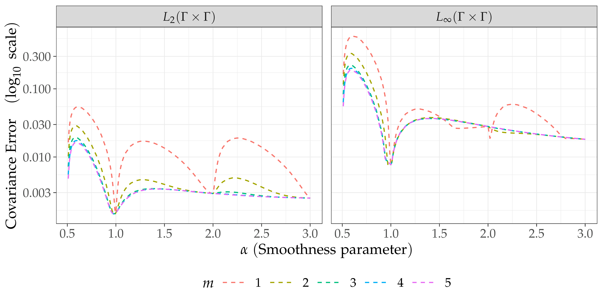
```


---

class: left, top

<div style="position:absolute; top:40px; right:55px;">
  
  
  
</div>

### Project 1 | Matrix form
*********

The covariance matrix of the weights $\mathbf{u} =  [u_1,\dots,u_{N_h}]^\top$ in $u_h(s) = \sum_{j=1}^{N_h} u_j \psi_j(s)$ can be written as 
\begin{equation}
\label{sigmau}
\textstyle
    \mathbf{\Sigma}_{\mathbf{u}} = \boldsymbol{\tau}^{-1}(\mathbf{L}^{-1}\mathbf{C})^{\lfloor \alpha \rfloor}\sum_{i=1}^mr_i(\mathbf{L}-p_i\mathbf{C})^{-1}\boldsymbol{\tau}^{-1} + \boldsymbol{\tau}^{-1}\mathbf{K}_{\lfloor \alpha \rfloor}\boldsymbol{\tau}^{-1},
\end{equation}
which let us to express $\mathbf{u} = \sum_{i=1}^{m+1} \mathbf{u}_i$, where $\mathbf{u}_i\sim N(\mathbf{0}, \mathbf{Q}_i^{-1})$ and 
\begin{equation*}
    \mathbf{Q}_i = 
    \begin{cases}
        r_i^{-1}\boldsymbol{\tau}(\mathbf{L}-p_i\mathbf{C})(\mathbf{C}^{-1}\mathbf{L})^{\lfloor \alpha \rfloor}\boldsymbol{\tau}&\text{ if } i= 1,\dots,m,\\
        \boldsymbol{\tau}\mathbf{K}^{-1}_{\lfloor \alpha \rfloor}\boldsymbol{\tau}&\text{ if } i = m+1.
    \end{cases}
\end{equation*}
Suppose we observe $\mathbf{y} = [y_1,\dots,y_n]^\top$ following $y_i \mid u(\cdot) \sim \mathsf{N}(u(s_i), \sigma_\epsilon^2)$, $i=1,\dots,n$. Then the model admits
\begin{align*}
    \mathbf{U} \sim \mathsf{N}(\mathbf{0}, \mathbf{Q}^{-1}), \quad
    \mathbf{y} \mid \mathbf{U} \sim \mathsf{N}(\overline{\mathbf{A}}\mathbf{U}, \mathbf{Q}_\epsilon^{-1}), \quad \mathbf{Q}_\epsilon = \sigma_\epsilon^{-2}\mathbf{I}, \quad  \mathbf{U} = [\mathbf{u}_1^\top,\dots,\mathbf{u}_{m+1}^\top]^\top, \quad \mathbf{Q} = \operatorname{diag}(\mathbf{Q}_1,\ldots,\mathbf{Q}_{m+1}).
\end{align*}

This yields an efficient kriging predictor $\boldsymbol{\mu}_{\mathbf{U} \mid \mathbf{y}} = \mathbf{Q}_{\mathbf{U} \mid \mathbf{y}}^{-1}\,\overline{\mathbf{A}}^\top \mathbf{Q}_\epsilon \mathbf{y}$ and the log-likelihood $\ell(\mathbf{y})$ is given by
\begin{align*}
2\ell(\mathbf{y}) = \log |\mathbf{Q}| + \log |\mathbf{Q}_\epsilon| - \log |\mathbf{Q}_{\mathbf{U} \mid \mathbf{y}}| - \boldsymbol{\mu}_{\mathbf{U} \mid \mathbf{y}}^\top \mathbf{Q}\boldsymbol{\mu}_{\mathbf{U} \mid \mathbf{y}} - (\mathbf{y} - \overline{\mathbf{A}}\boldsymbol{\mu}_{\mathbf{U} \mid \mathbf{y}})^\top \mathbf{Q}_\epsilon (\mathbf{y} - \overline{\mathbf{A}}\boldsymbol{\mu}_{\mathbf{U} \mid \mathbf{y}}) - n\log(2\pi).
\end{align*}


---

class: left, top

<div style="position:absolute; top:40px; right:55px;">
  
  
  
</div>

### Project 1 | Model properties
*********


```{r, echo = FALSE, fig.align='center', out.width='90%', fig.cap = captioner("Illustration of the nonstationarity (left) and arbitrary smoothness (right) of the covariance function \\(\\varrho^{\\alpha}_{h,m}(s_i,\\cdot)\\).")}

```


---

class: left, top

<div style="position:absolute; top:40px; right:55px;">
  
  
  
</div>

### Project 1 | Variance-stationary Whittle-Matérn fields
*********


```{r, echo = FALSE, fig.align='center', out.width='70%', fig.cap = captioner("Marginal standard deviation \\(\\sigma_{\\kappa}(\\cdot)\\) of a Whittle-Matérn field with \\(\\tau = 1\\) (left), and of a generalized Whittle-Matérn field with \\(\\tau(\\cdot) = \\sigma_{\\kappa}(\\cdot)\\) (right).")}
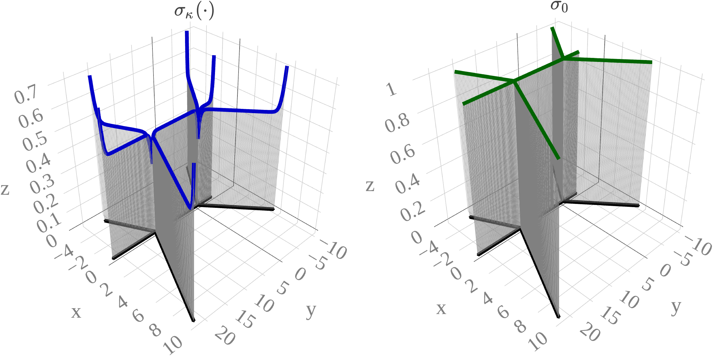
```


---

class: center, middle

<div style="position:absolute; top:40px; right:55px;">
  
  
  
</div>


## Project 2

*********

# Numerical approximation of fractional diffusion equations on metric graphs

*********


---

class: left, top

<div style="position:absolute; top:40px; right:55px;">
  
  
  
</div>

### Project 2 | Problem setting
*********


We analyze and numerically approximate solutions to fractional diffusion equations on metric graphs of the form

.custom-box[
$$
\tag{6}
\begin{cases}
  \partial_t u(s,t) + (\kappa^2 - \Delta_\Gamma)^{\alpha/2} u(s,t) & = f(s,t), \quad (s,t) \in \Gamma \times (0, T), \\
  u(s,0) & = u_0(s), \quad s \in \Gamma,
\end{cases}
$$
]

where $u(\cdot,t)$ satisfies the Kirchhoff vertex conditions $(5)$, $\Gamma = (\mathcal{V},\mathcal{E})$ is a compact metric graph, $\kappa>0$, $\alpha\in(0,2]$ determines the smoothness of $u(\cdot,t)$, and $\Delta_{\Gamma}$ is the Kirchhoff-Laplacian.


---

class: left, top

<div style="position:absolute; top:40px; right:55px;">
  
  
  
</div>

### Project 2 | Existence and uniqueness
*********

We interpret $(6)$ as an abstract Cauchy problem in $L_2(\Gamma)$, given by

.custom-box[
$$
\tag{7}
\begin{cases}
    \partial_tu(t)+L^{\alpha/2}u(t)=f(t),\quad t\in (0, T),\\  
    u(0)=u_0\in D(L^{\alpha/2}).
\end{cases}
$$
]


<div class="content-box-myblue">
Theorem 1
</div>

.content-box-gray[
If $f\in L_2(\Gamma\times(0,T))$  and $u_0\in \dot{H}^{\alpha}(\Gamma)$, then $(7)$ has a unique mild solution given by the variation of parameters formula
\begin{equation}
\tag{8}
\label{solbyvarform}
u(t) = T(t)u_0 + \int_0^t T(t-r)f(r)dr,\quad t\geq 0.
\end{equation}
]

---

class: left, top

<div style="position:absolute; top:40px; right:55px;">
  
  
  
</div>

### Project 2 | Discretization | Space
*********

- The spatial domain is discretized using the **finite element method**.

---

class: left, top

<div style="position:absolute; top:40px; right:55px;">
  
  
  
</div>

### Project 2 | Discretization | Time
*********

- **Backward Euler scheme**

- To discretize the time domain, we divide the interval $[0, T]$ into $N$ **uniform subintervals** with time steps $t_k = k\tau,\; k = 0, \dots, N$, where $\tau = T/N$ is the time step size. 

- For a function $\phi$, we denote its value at $t_k$ by $\phi^k=\phi(t_k)$ and let $\phi^\tau$ denote the sequence of evaluations $\{\phi^k\}_{k=0}^N$ at the time step sequence $\{t_k\}_{k=0}^N$. 

- For any sequence $\phi^\tau$, we let $\tilde{\phi}^\tau$ represent the piecewise constant function given by

$$
\begin{cases}
 \tilde{\phi}^\tau(0) = \phi^0\\
\tilde{\phi}^\tau(t) = \phi^k,\quad t\in(t_{k-1},t_k],\quad k=1,\dots, N.
\end{cases}
$$


---

class: left, top

<div style="position:absolute; top:40px; right:55px;">
  
  
  
</div>

### Project 2 | Discrete Operator
*********

<div class="content-box-myblue">
Definition 1
</div>

.content-box-gray[
For $\alpha\in[0,2]$, we define the discrete version of $L^{\alpha/2}$ as $L_h^{\alpha/2}:V_h\to V_h$ via 
$$(L_h^{\alpha/2}\phi_h,\psi_h)_{L_2(\Gamma)} = \mathfrak{a}(\phi_h, \psi_h),\quad \phi_h,\psi_h\in V_h,\tag{9}$$ where the bilinear form $\mathfrak{a}:\dot{H}^{\alpha/2}(\Gamma)\times \dot{H}^{\alpha/2}(\Gamma)\to \mathbb{R}$ is defined by
$$\mathfrak{a}(\phi,\psi) := (L^{\alpha/4}\phi,L^{\alpha/4}\psi)_{L_2(\Gamma)}, \quad \phi,\psi\in\dot{H}^{\alpha/2}(\Gamma).$$
]

**Weak form of $(1)$**: Find $u$ such that
$$
\begin{cases}
    \langle\partial_tu,\phi\rangle + \mathfrak{a}(u,\phi) &= \langle f,\phi\rangle,\quad\forall \phi\in \dot{H}^{\alpha/2}(\Gamma),\quad \text{a.e. } t\in(0,T),\\  
    u(0)&=u_0.
\end{cases}
\tag{10}
$$

---

class: left, top

<div style="position:absolute; top:40px; right:55px;">
  
  
  
</div>

### Project 2 | Approximation | time-level
*********

Let $\alpha>0$ and $U^\tau$ denote the sequence of approximations of the solution to problem $(10)$ at each time step. That is, $U^{\tau}\subset\dot{H}^{\alpha/2}(\Gamma)$ solves
$$
\begin{cases}
    \langle\delta U^{k+1},\phi\rangle + \mathfrak{a}(U^{k+1},\phi)  &= \langle f^{k+1},\phi\rangle , \quad\forall\phi\in \dot{H}^{\alpha/2}(\Gamma),\quad k=0,\dots, N-1, \\
    U^0 &= u_0.
\end{cases}
\tag{11}
$$

<div class="content-box-myblue">
Theorem 2
</div>

.content-box-gray[
Let $\alpha>0$ and $u$ be the solution to $(10)$. Let $\tilde{U}^\tau$ be the piecewise constant function constructed from the solution to $(11)$. If $f\in L_\infty(\Gamma\times(0,T))$ and $u_0\in\dot{H}^{\alpha/2}(\Gamma)$, then
$$\|u-\tilde{U}^\tau\|_{L_2(\Gamma\times(0,T))}\lesssim \tau \left(\|u_0\|_{\dot{H}^{\alpha/2}(\Gamma)}+\|f\|_{L_\infty(\Gamma\times(0,T))}\right).$$
]

---

class: left, top

<div style="position:absolute; top:40px; right:55px;">
  
  
  
</div>

### Project 2 | Approximation | space-level
*********


Let $\alpha\in(0,2]$ and $U_h^\tau$ denote the sequence of approximations of the solution to problem $(10)$ at each time step on a mesh indexed by $h$. That is, $U_h^{\tau}\subset V_h$ solves
$$
\begin{cases}
    \langle\delta U_h^{k+1},\phi\rangle + \mathfrak{a}(
        U_h^{k+1},\phi) &= \langle f^{k+1},\phi\rangle, \quad\forall\phi\in V_h,\quad k=0,\dots, N-1, \\
    U^0_h &= P_hu_0, 
\end{cases}
\tag{12}
$$

<div class="content-box-myblue">
Theorem 3
</div>

.content-box-gray[
Let $\alpha\in[0,2]$ and $U^\tau$ and $U_h^\tau$ be the solutions to $(11)$ and $(12)$, respectively. If $f\in L_2(\Gamma\times(0,T))$ and $u_0\in\dot{H}^{\alpha}(\Gamma)$, then
$$\|U^\tau-U_h^\tau\|_{\ell^2(L_2(\Gamma))}\lesssim h^{\alpha}\left(\|u_0\|_{\dot{H}^{\alpha}(\Gamma)} + \|f^\tau\|_{\ell^2(L_2(\Gamma))}\right).$$
]


---

class: left, top

<div style="position:absolute; top:40px; right:55px;">
  
  
  
</div>

### Project 2 | Approximation | rational approx-level 1/2
*********

The corresponding strong form of $(12)$ is given by
$$(I_{V_h}+\tau (\kappa^{2})^{\alpha/2}(L_h/\kappa^2)^{\alpha/2})U_h^{k+1} = U_h^{k}+\tau f^{k+1}.\tag{13}$$
Let $\beta = \alpha/2$. Applying $(L_h/\kappa^2)^{-\beta}$ to $(13)$ yields 
$$((L_h/\kappa^2)^{-\beta}+\tau \kappa^{2\beta} I_{V_h})U_h^{k+1}=(L_h/\kappa^2)^{-\beta}(U_h^{k}+\tau f^{k+1}).\tag{14}$$
.content-box-gray[
We now consider a rational approximation of $(L_h/\kappa^2)^{-\beta}$ of the form 
$$r_m((L_h/\kappa^2)^{-1})= p_\ell(L_h/\kappa^2)^{-1}p_r(L_h/\kappa^2).\tag{15}$$
]


---

class: left, top

<div style="position:absolute; top:40px; right:55px;">
  
  
  
</div>

### Project 2 | Approximation | rational approx-level 2/2
*********

Replacing the rational approximation of $(L_h/\kappa^2)^{-\beta}$ in $(14)$ yields 
$$(r_m((L_h/\kappa^2)^{-1})+\tau \kappa^{2\beta} I_{V_h})U_{h,m}^{k+1}=r_m((L_h/\kappa^2)^{-1})(U_{h,m}^{k}+\tau f^{k+1}),\tag{16}$$
where the subindex $m$ indicates the dependence of the solution on the degree of the rational approximation.


<div class="content-box-myblue">
Theorem 4
</div>

.content-box-gray[
Let $\alpha\in[0,2]$ and $u$ be the solution to $(10)$. Assume further that for $k=0,\dots,N-1$, $U^{k+1}_{h,m}\in V_h$ solves the weak form of $(16)$ with $U^{0}_{h,m}= U^{0}_{h}$. If $f\in L_\infty(\Gamma\times(0,T))$ and $u_0\in\dot{H}^{\alpha}(\Gamma)$, then
$$\|u-U_{h,m}^\tau\|_{L_2(\Gamma\times(0,T))}\lesssim\tau+h^\alpha + h^{\alpha-2}\mathrm{e}^{-2\pi\sqrt{(1-\alpha/2)m}},\tag{17}$$
where the hidden constant depends on $\|u_0\|_{L_2(\Gamma)} +\|f\|_{L_\infty(\Gamma\times(0,T))}$.
]

---

class: left, top

<div style="position:absolute; top:40px; right:55px;">
  
  
  
</div>

### Project 2 | Matrix representation 1/2
*********


To derive the matrix representation of the numerical scheme, we first use $(15)$ to rewrite $(16)$ as
$$(p_r(L_h/\kappa^2)+\tau \kappa^{2\beta}p_\ell(L_h/\kappa^2))U_{h,m}^{k+1}= p_r(L_h/\kappa^2) (U_{h,m}^{k}+\tau f^{k+1}).\tag{18}$$
We can now go one step further and isolate the numerical solution at time $t_{k+1}$ by consider the following partial fraction decomposition 
$$\dfrac{p_r(x)}{p_r(x)+\tau \kappa^{2\beta}p_\ell(x)} =  \sum_{k=1}^{m+1}a_k(x-p_k)^{-1} + r,\tag{19}$$
where $\{a_k\}_{k=1}^{m+1}$ and $\{p_k\}_{k=1}^{m+1}$ are the residues and poles, respectively, and $r$ denotes the remainder. Substituting this into $(18)$ gives the iteration rule
$$U_{h,m}^{k+1}= \left(\sum_{k=1}^{m+1}a_k(L_h/\kappa^2-p_kI_{V_h})^{-1} + rI_{V_h}\right) (U_{h,m}^{k}+\tau f^{k+1}).\tag{20}$$


---

class: left, top

<div style="position:absolute; top:40px; right:55px;">
  
  
  
</div>

### Project 2 | Matrix representation 2/2
*********


Substituting the expansion $U_h^k(s) =  \sum_{i=1}^{N_h}u_i^k\psi^i_h(s)$, $s\in\Gamma$ into the weak form $(20)$ yields the following matrix iteration
$$\mathbf{U}_{k+1} = \mathbf{C}^{-1}\left(\sum_{k=1}^{m+1} a_k\left(\mathbf{L}\mathbf{C}^{-1}/\kappa^2-p_k\mathbf{I}_{N_h}\right)^{-1} + r\mathbf{I}_{N_h}\right) (\mathbf{C}\mathbf{U}_k+\tau \mathbf{F}_{k+1}),\tag{21}$$
where $\mathbf{L} = \kappa^2\mathbf{C}+\mathbf{G}$, the matrix $\mathbf{C}\in\mathbb{R}^{N_h\times N_h}$ has entries $\mathbf{C}_{i,j} = (\psi^i_h,\psi^j_h)_{L_2(\Gamma)}$, $\mathbf{G}\in\mathbb{R}^{N_h\times N_h}$ has entries $\mathbf{G}_{i,j} = ({\psi^{i}_h}',{\psi^{j}_h}')_{L_2(\Gamma)}$, $\mathbf{U}_k\in\mathbb{R}^{N_h}$ has entries $u_i^k$, and $\mathbf{F}_k\in\mathbb{R}^{N_h}$ has components $(f^{k},\psi^i_h)_{L_2(\Gamma)}$. 

In practice, since the rational function in $(19)$ is proper, there is no remainder $r$. Moreover, since $( \mathbf{L}\mathbf{C}^{-1}/\kappa^2-p_k\mathbf{I}_{N_h})^{-1}  = \mathbf{C}(\mathbf{L}/\kappa^2-p_k\mathbf{C})^{-1}$, iteration $(21)$ reduces to
$$\mathbf{U}_{k+1} = \mathbf{R}(\mathbf{C}\mathbf{U}_k+\tau \mathbf{F}_{k+1}),\quad \mathbf{R} = \sum_{k=1}^{m+1} a_k\left(\mathbf{L}/\kappa^2-p_k\mathbf{C}\right)^{-1},\tag{22}$$
where it is evident that only sparse solves are required.

---

class: left, top

<div style="position:absolute; top:40px; right:55px;">
  
  
  
</div>

### Project 2 | Numerical experiments 1/2
*********

Using the spectral representation $(3)$ of the semigroup $T(t)$, the solution $(8)$ of problem $(7)$ can be expressed as

.content-box-gray[
$$u(s,t) = \displaystyle\sum_{j\in\mathbb{N}}\text{e}^{-\lambda^{\alpha/2}_jt}\left(u_0, e_j\right)_{L_2(\Gamma)}e_j(s) + \int_0^t \displaystyle\sum_{j\in\mathbb{N}}\text{e}^{-\lambda^{\alpha/2}_j(t-r)}\left(f(r), e_j\right)_{L_2(\Gamma)}e_j(s)dr.$$
]

- Choose $\{x_j\}_{j=1}^{\infty}$ and set $u_0(s) = \sum_{j=1}^{\infty}x_je_j(s)$.
- Choose a scalar function $g(t)$ and coefficients $\{y_j\}_{j=1}^{\infty}$ and let $f(s,t) = g(t)\sum_{j=1}^{\infty} y_j e_j(s)$.
 
-  The exact solution is then given by

.content-box-gray[
$$ u(s,t) = \sum_{j=1}^{\infty}(x_j+y_j G_j(t))\text{e}^{-\lambda^{\alpha/2}_jt}e_j(s),\quad G_j(t)= \int_0^t \text{e}^{\lambda^{\alpha/2}_jr}g(r)dr.$$
]

---

class: left, top

<div style="position:absolute; top:40px; right:55px;">
  
  
  
</div>

### Project 2 | Numerical experiments 2/2
*********

```{r, fig.height = 1.5, out.width = "100%", fig.cap = captioner("Comparison of the exact and approximate solution at selected time points.")}

```

---

class: left, top

<div style="position:absolute; top:40px; right:55px;">
  
  
  
</div>

### Project 2 | Convergence behavior | Calibration
*********

From Theorem 4, recall that the total error satisfies
$$\|u-U_{h,m}^\tau\|_{L_2(\Gamma\times(0,T))}\lesssim\tau+h^\alpha + h^{\alpha-2}e^{-2\pi\sqrt{(1-\alpha/2)m}}.$$

To observe the convergence behavior with respect to $\tau$, $h$, and $m$, we need to calibrate the discretization parameters. That essentially means that we set
$$\tau = h^\alpha = h^{\alpha-2}e^{-2\pi\sqrt{(1-\alpha/2)m}}$$
and solve for the other two parameters when the other is the one of interest.

**Example**: Convergence with respect to $h$.

- For a given $h$, set $\tau = h^\alpha$ and $m = \lceil\log_{\text{e}}^2(h)/(\pi^2(1-\alpha/2))\rceil$.

Therefore.

$$\|u-U_{h,m}^\tau\|_{L_2(\Gamma\times(0,T))}\lesssim C_h h^\alpha.$$


---

class: left, top

<div style="position:absolute; top:40px; right:55px;">
  
  
  
</div>

### Project 2 | Convergence behavior | Results
*********


      
```{r, echo = FALSE, fig.align='center', out.width='80%', fig.cap = captioner("Comparison between theoretical and observed convergence behavior for the error \\(\\|u-U_{h,m}^\\tau\\|_{L_2(\\Gamma\\times(0,T))}\\).")}
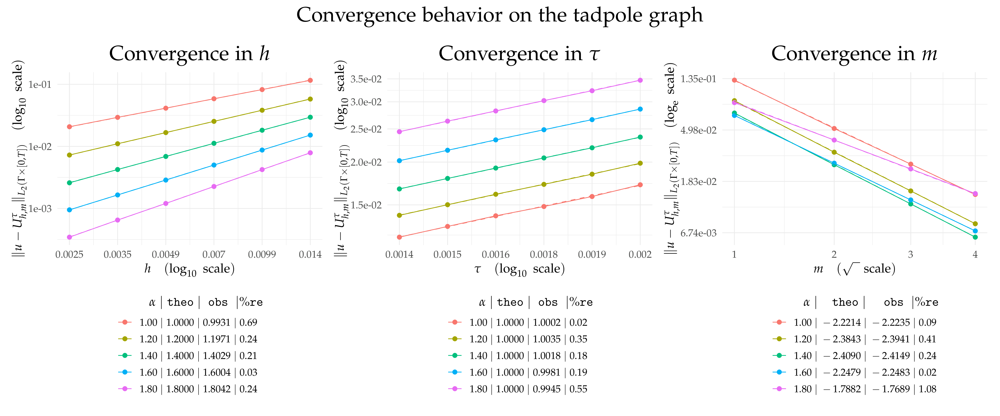
```


---

class: center, middle

<div style="position:absolute; top:40px; right:55px;">
  
  
  
</div>


## Project 3

*********

# Optimal control of fractional diffusion equations on metric graphs

*********


---

class: left, top

<div style="position:absolute; top:40px; right:55px;">
  
  
  
</div>

### Problem setting
*********

Let $u_d$ be the desired state, $z$ denote the control variable, and  $\mu>0$ a regularization parameter. We are concerned with the following PDE-constrained optimization problem: Find
$$\min\; J(u, z),\quad J(u, z)=  \frac{1}{2}\int_0^T\left(\left\|u-u_d\right\|_{L_2(\Gamma)}^2+\mu\|z\|_{L_2(\Gamma)}^2\right) dt\tag{20}$$
subject to the fractional diffusion equation 

.content-box-gray[
$$
\begin{cases}
\partial_t u(s,t) + (\kappa^2 - \Delta_\Gamma)^{\alpha/2} u(s,t) & = f(s,t)+z(s,t), \quad (s,t) \in \Gamma \times (0, T), \\
u(s,0) & = u_0(s), \quad s \in \Gamma,
\end{cases}
\tag{21}
$$
]

where $u$ satisfies the Kirchhoff vertex conditions \eqref{eq:Kcondfirstpart}, and $z$ satisfies the control constraints 
\begin{align}
\label{control_constraints}
\tag{22}
    a(s,t)\leq z(s,t)\leq b(s,t)\quad\text{ a.e. } (s,t)\in\Gamma \times(0, T).
\end{align}


---

class: left, top

<div style="position:absolute; top:40px; right:55px;">
  
  
  
</div>

### Adjoint state
*********


The solution $p=p(z)$ of

.content-box-gray[
$$
\begin{cases}
    -\partial_t p(s,t) + (\kappa^2 - \Delta_\Gamma)^{\alpha/2} p(s,t) &= u(s,t)-u_d(s,t),  \quad (s,t) \in \Gamma \times (0, T), \\
    p(s,T) &= 0,  \quad s \in \Gamma,
\end{cases}
\tag{23}
$$
]

is called the fractional adjoint state associated to $u = u(z)$


---

class: left, top

<div style="position:absolute; top:40px; right:55px;">
  
  
  
</div>

### Projection formula
*********

The optimal control variable $\bar{z}$ is related to the optimal adjoint state $\bar{p}$ via the projection formula `r Cite(myBib, "Troltzsch2025optimal")`.
\begin{align}
\tag{24}
\label{proj_formula}
    \bar{z}  = \min\left\{b ,\max\left\{a ,-\bar{p}/\mu \right\}\right\}.
\end{align}

We rely in the following result.

<div class="content-box-myblue">
Lemma
</div>

.content-box-gray[
A triple $(u, p, z)$ is optimal for $(20)$ - $(22)$ if and only if $u$ and $p$ satisfy the state and adjoint equations, respectively, and $z$ satisfies \eqref{proj_formula}.
]


---

class: left, top

<div style="position:absolute; top:40px; right:55px;">
  
  
  
</div>

### Error estimates
*********

<div class="content-box-myblue">
Theorem 5
</div>

.content-box-gray[
Let $\alpha\in[0,2]$ and $\bar{u}$ be the solution to $(21)$ corresponding to the optimal control $\bar{z}$ of $(20)$ - $(22)$. Let $\bar{U}_{h,m}^\tau$ denote the piecewise linear approximation of the optimal discrete state obtained from the discrete scheme after the rational approximation. Let $\bar{Z}_{h,m}^\tau$ denote the corresponding piecewise constant approximation of the optimal discrete control. If $f,u_d\in L_2((0,T);\dot{H}^\beta(\Gamma)) \cap L_\infty(\Gamma\times(0,T))$ for $\beta<1$ and $u_0\in\dot{H}^{\alpha}(\Gamma)$ , then

$$\|\bar{u}-\bar{U}_{h,m}^\tau\|_{L_2(\Gamma\times(0,T))}\lesssim\tau+h^\alpha + h^{\alpha-2}e^{-2\pi\sqrt{(1-\alpha/2)m}}$$

and

$$\|\bar{z}-\bar{Z}_{h,m}^\tau\|_{L_2(\Gamma\times(0,T))}\lesssim\tau+h^\alpha + h^{\alpha-2}e^{-2\pi\sqrt{(1-\alpha/2)m}}.$$
]


---

class: left, top

<div style="position:absolute; top:40px; right:55px;">
  
  
  
</div>

### Forward-backward sweep method
*********

At a high level, FBSM follows these steps.

a. *Initialization:* Choose an initial approximation for $\bar{z}$. 

b. *State solve:* Using $\bar{z}$, solve $(21)$ to obtain $\bar{u}$. 

c. *Adjoint solve:* Using $\bar{u}$, solve $(23)$ to obtain $\bar{p}$. 

d. *Control update:* Update $\bar{z}$ via the projection formula \eqref{proj_formula}. 

e. *Iteration:* Repeat steps b - d until convergence. 

---

class: left, top

<div style="position:absolute; top:40px; right:55px;">
  
  
  
</div>

### Fully discrete FBSM
*********

1 *Initialization:* Initialize $\mathbf{\bar{Z}}\in \mathbb{R}^{N_{h}\times (N+1)}$.

2 *State solve:* Given $\mathbf{\bar{Z}}$, compute $\mathbf{\bar{U}}\in \mathbb{R}^{N_{h}\times (N+1)}$ with the iteration

$$
\begin{cases}
  \mathbf{\bar{U}}_{k+1}  &= \mathbf{R}\mathbf{C}\mathbf{\bar{U}}_k+\tau \mathbf{R}(\mathbf{F}_{k+1}+\mathbf{C}\mathbf{\bar{Z}}_{k+1}),\quad k = 0,\dots, N-1,\\
    \mathbf{\bar{U}}_{0} & = [u_0(s_1), \dots, u_0(s_{N_h})]^\top.
\end{cases}
\tag{25}
$$

3 *Adjoint solve:* Given $\mathbf{\bar{U}}$ from Step 2, compute $\mathbf{\bar{P}}\in \mathbb{R}^{N_{h}\times (N+1)}$ with the iteration
$$
\begin{cases}
    \mathbf{\bar{P}}_{k} & = \mathbf{R}\mathbf{C}\mathbf{\bar{P}}_{k+1}+\tau \mathbf{R}(\mathbf{C}\mathbf{\bar{U}}_{k+1}-\mathbf{D}_{k+1}),\quad k = N-1,\dots, 0,\\
    \mathbf{\bar{P}}_{N} & = \mathbf{0}.
\end{cases}
\tag{26}
$$


4 *Control update:* Given $\mathbf{\bar{P}}$ from Step 3, update 
$$\mathbf{\bar{Z}} = \max\{\mathbf{A},\min\{\mathbf{B},-\mathbf{\bar{P}}/\mu\}\}\quad \text{(entry-wise)}.$$

5 *Iteration:* Repeat steps 2-4 until convergence.


---

class: left, top

<div style="position:absolute; top:40px; right:55px;">
  
  
  
</div>

### Convergence analysis of the FBSM
*********

The unfolded iterations in $(25)$ and $(26)$ can equivalently be written in block-matrix form as


```{r, echo=FALSE, fig.align='center', out.width='70%'}
# figures
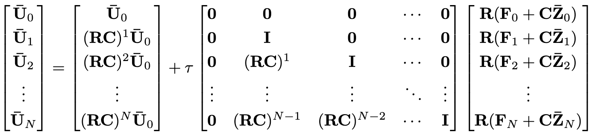
```

and 

```{r, echo=FALSE, fig.align='center', out.width='60%'}
# figures
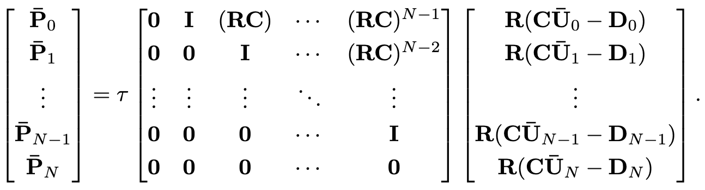
```

---

class: left, top

<div style="position:absolute; top:40px; right:55px;">
  
  
  
</div>

### Matrix vs Vector form
*********


$$
\begin{cases}
    (1) \text{ Initialize } \mathbf{\bar{Z}},\\
    (2) \text{ Compute }\mathbf{\bar{U}} \text{ by }\mathbf{\bar{U}}_{k+1}  = \mathbf{R}(\mathbf{C}\mathbf{\bar{U}}_k+\tau (\mathbf{F}_{k+1}+\mathbf{C} \mathbf{\bar{Z}}_{k+1})),\\
    (3)\text{ Compute }\mathbf{\bar{P}}\text{ by }\mathbf{\bar{P}}_{k}  = \mathbf{R}(\mathbf{C}\mathbf{\bar{P}}_{k+1}+\tau (\mathbf{C} \mathbf{\bar{U}}_{k+1}-\mathbf{D}_{k+1})),\\
    (4)\text{ Update } \mathbf{\bar{Z}} = \max\{\mathbf{A},\min\{\mathbf{B},-\mathbf{\bar{P}}/\mu\}\},\\
    (5)\text{ Repeat }(2) - (4) \text{ until convergence},
\end{cases}
\quad
\begin{cases}
     (1) \text{ Initialize } \mathbf{\bar{z}},\\
    (2) \text{ Compute }\mathbf{\bar{u}} = \mathbf{h} + \mathbf{S}_{\mathrm{F}}\mathbf{\hat{R}}(\mathbf{f}+\mathbf{M}\mathbf{\bar{z}}),\\
    (3) \text{ Compute }\mathbf{\bar{p}}  = \mathbf{S}_{\mathrm{B}}\mathbf{\hat{R}}(\mathbf{M}\mathbf{\bar{u}} - \mathbf{d}),\\
    (4)\text{ Update }\mathbf{\bar{z}}  = \max\{\mathbf{a}, \min\{\mathbf{b}, -\mathbf{\bar{p}}/\mu\}\},\\
    (5)\text{ Repeat }(2) - (4) \text{ until convergence},
\end{cases}
$$

where

\begin{align*}
 \mathbf{\bar{u}} = \text{vec}(\mathbf{\bar{U}}),\quad 
\mathbf{\bar{p}} = \text{vec}(\mathbf{\bar{P}}),\quad
\mathbf{\bar{z}} = \text{vec}(\mathbf{\bar{Z}}),\quad \mathbf{f} = \text{vec}(\mathbf{F}),\quad
\mathbf{d} =\text{vec}(\mathbf{D}), 
\end{align*}

\begin{align*}
\mathbf{a} =\text{vec}(\mathbf{A}),\quad
\mathbf{b} = \text{vec}(\mathbf{B}),\quad \mathbf{h}= [\mathbf{\bar{U}}_{0}^\top ((\mathbf{R}\mathbf{C})^{1}\mathbf{\bar{U}}_{0})^\top ((\mathbf{R}\mathbf{C})^{2} \mathbf{\bar{U}}_{0})^\top\dots ((\mathbf{R}\mathbf{C})^{N}\mathbf{\bar{U}}_{0})^\top]^\top,
\end{align*}
\begin{align*}
\mathbf{M} = \mathbf{I}_{N+1}\otimes  \mathbf{C},\quad \mathbf{\hat{J}}_{N+1} = \mathbf{J}_{N+1}\otimes \mathbf{I}_{N_h},\quad \mathbf{\hat{R}} = \mathbf{I}_{N+1}\otimes  \mathbf{R}.
\end{align*}


---

class: left, top

<div style="position:absolute; top:40px; right:55px;">
  
  
  
</div>

### Fixed-point iteration | 1
*********

**Vectorized formulation**

\begin{align*}
    \mathbf{\bar{z}}  =  \underbrace{\max\{\mathbf{a}, \min\{\mathbf{b}, -(\mathbf{S}_{\mathrm{B}}\mathbf{\hat{R}}\mathbf{M}\mathbf{h}+\mathbf{S}_{\mathrm{B}}\mathbf{\hat{R}}\mathbf{M}\mathbf{S}_{\mathrm{F}}\mathbf{\hat{R}}\mathbf{f}-\mathbf{S}_{\mathrm{B}}\mathbf{\hat{R}}\mathbf{d}+\mathbf{S}_{\mathrm{B}}\mathbf{\hat{R}}\mathbf{M}\mathbf{S}_{\mathrm{F}}\mathbf{\hat{R}}\mathbf{M}\mathbf{\bar{z}})/\mu\}\}}_{\mathfrak{T}(\mathbf{z})}.
\end{align*}
The vectorized formulation naturally induces the iterative scheme $\mathbf{\bar{z}}^{(n+1)}  = \mathfrak{T}(\mathbf{\bar{z}}^{(n)})$.

**Matrix formulation**

Define the matrix-level counterpart of $\mathfrak{T}$ as
\begin{align*}
  \mathcal{T}(\mathbf{X}) = \text{vec}^{-1}(\mathfrak{T}(\text{vec}(\mathbf{X}))) = \text{vec}^{-1}(\mathfrak{T}(\mathbf{x})).
\end{align*}
The corresponding iterative scheme then reads $\mathbf{\bar{Z}}^{(n+1)}  = \mathcal{T}(\mathbf{\bar{Z}}^{(n)})$.


---

class: left, top

<div style="position:absolute; top:40px; right:55px;">
  
  
  
</div>

### Fixed-point iteration | 2
*********
 
The quadrature-based norm, natural for the matrix formulation, and the weighted Euclidean norm, natural for the vectorized formulation, are equivalent up to the factor $\sqrt{\tau}$:
$$\|\mathbf{X}\|_{\mathfrak{q}}  = \sqrt{\tau}\|\mathbf{x}\|_{\mathbf{C}_{N+1}}.$$

 <div class="content-box-myblue">
Proposition 1
</div>

.content-box-gray[
If $\mu\kappa^{4\beta}>1$, then $\mathcal{T}$ is a contraction with respect to the $\|\cdot\|_{\mathfrak{q}}$ norm and $\mathfrak{T}$ is a contraction with respect to the $\mathbf{C}_{N+1}$-weighted norm, both with contraction constant $\gamma =  1/(\mu\kappa^{4\beta})$.
]

By the Banach fixed-point theorem, $(\mathbf{\bar{z}}^{(n)})_{n\in\mathbb{N}}$ converges to a unique fixed point $\mathbf{\bar{z}}^\star$, which uniquely determines the optimal state via $\mathbf{\bar{u}}^{\star} = \mathbf{h} + \mathbf{S}_{\mathrm{F}}\mathbf{\hat{R}}(\mathbf{f}+\mathbf{M}\mathbf{\bar{z}}^{\star})$.

---

class: left, top

<div style="position:absolute; top:40px; right:55px;">
  
  
  
</div>

### Idea of the proof 
*********
 
Let $\mathbf{X}, \mathbf{Y}\in\mathbb{R}^{N_h\times(N+1)}$ and $\mathbf{x} =\text{vec}(\mathbf{X}),\mathbf{y} = \text{vec}(\mathbf{Y})\in \mathbb{R}^{(N+1)N_h}$ be their vectorized forms. Then

\begin{align}
    \|\mathcal{T}(\mathbf{X}) - \mathcal{T}(\mathbf{Y})\|_{\mathfrak{q}} & =  \|\text{vec}^{-1}(\mathfrak{T}(\mathbf{x})) - \text{vec}^{-1}(\mathfrak{T}(\mathbf{y}))\|_{\mathfrak{q}}\\
    & =  \|\text{vec}^{-1}(\mathfrak{T}(\mathbf{x})-\mathfrak{T}(\mathbf{y}))\|_{\mathfrak{q}}\\
    & = \sqrt{\tau}\|\mathfrak{T}(\mathbf{x})-\mathfrak{T}(\mathbf{y})\|_{\mathbf{C}_{N+1}}.\label{Lip1}
\end{align}
From the Lipschitz property of the componentwise projection operator $\Pi(\mathbf{x}) := \max\{\mathbf{a}, \min\{\mathbf{b}, -\mathbf{x}/\mu\}\}$, we have
\begin{align}
    \|\mathfrak{T}(\mathbf{x})-\mathfrak{T}(\mathbf{y})\|_{\mathbf{C}_{N+1}} &\leq (1/\mu)\| \mathbf{S}_{\mathrm{B}}\mathbf{\hat{R}}\mathbf{M}\mathbf{S}_{\mathrm{F}}\mathbf{\hat{R}}\mathbf{M}\mathbf{x}-\mathbf{S}_{\mathrm{B}}\mathbf{\hat{R}}\mathbf{M}\mathbf{S}_{\mathrm{F}}\mathbf{\hat{R}}\mathbf{M}\mathbf{y}\|_{\mathbf{C}_{N+1}}\\
    &\leq (1/\mu)\| \mathbf{S}_{\mathrm{B}}\mathbf{\hat{R}}\mathbf{M}\mathbf{S}_{\mathrm{F}}\mathbf{\hat{R}}\mathbf{M}\|_{\mathbf{C}_{N+1}}\|\mathbf{x}-\mathbf{y}\|_{\mathbf{C}_{N+1}}\\
    &= \gamma\|\mathbf{x}-\mathbf{y}\|_{\mathbf{C}_{N+1}},\label{Lip2}
\end{align}
where $\gamma = (1/\mu)\|\boldsymbol{\mathfrak{L}}\|_{\mathbf{C}_{N+1}}$ and $\boldsymbol{\mathfrak{L}} = \mathbf{S}_{\mathrm{B}}\mathbf{\hat{R}}\mathbf{M}\mathbf{S}_{\mathrm{F}}\mathbf{\hat{R}}\mathbf{M}$.


---

class: left, top

<div style="position:absolute; top:40px; right:55px;">
  
  
  
</div>

### Example
*********

With $N=3$, matrix $\boldsymbol{\mathfrak{L}}$ has the form

```{r, echo=FALSE, fig.align='center', out.width='70%'}
# figures
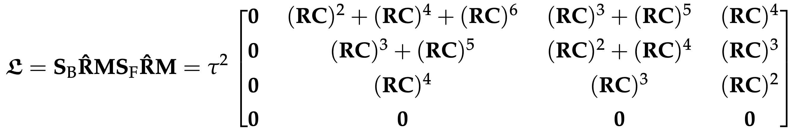
```

Define a scalar matrix $\mathbf{T}$ as $\mathbf{T}  = \begin{bmatrix}\omega^2+\omega^4+\omega^6 & \omega^3+\omega^5 & \omega^4\\\omega^3+\omega^5 & \omega^2+\omega^4 & \omega^3\\\omega^4 & \omega^3 & \omega^2\\\end{bmatrix}$, where $\omega = \dfrac{1}{1+\tau\kappa^{2\beta}}<1.$

One can show that $\|\boldsymbol{\mathfrak{L}}\|_{\mathbf{C}_{N+1}} = \tau^2\|\mathbf{T}\|_2$ and $\|\mathbf{T}\|_2  \leq \dfrac{1}{\tau^2\kappa^{4\beta}}$. Consequently,
$$\gamma = \dfrac{1}{\mu}\|\boldsymbol{\mathfrak{L}}\|_{\mathbf{C}_{N+1}} =  \dfrac{\tau^2}{\mu}\|\mathbf{T}\|_2 \leq \dfrac{\tau^2}{\mu} \dfrac{1}{\tau^2\kappa^{4\beta}} = \dfrac{1}{\mu\kappa^{4\beta}}.$$

---

class: left, top

<div style="position:absolute; top:40px; right:55px;">
  
  
  
</div>

### Contraction constant
*********


```{r, echo=FALSE, fig.align='center', out.width='70%', fig.cap = captioner("Comparison between the contraction constant and its upper bound.")}
# figures
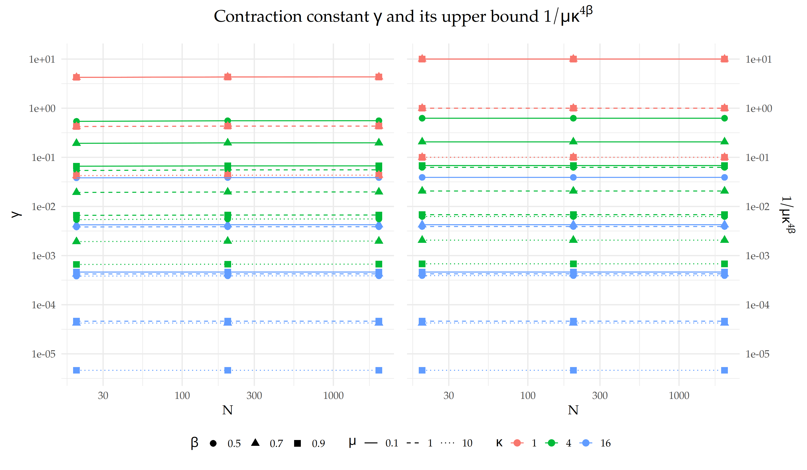
```

---

class: left, top

<div style="position:absolute; top:40px; right:55px;">
  
  
  
</div>

### Convergence behavior | 1
*********


```{r, echo = FALSE, fig.align='center', out.width='75%', fig.cap = captioner("Comparison between theoretical and observed convergence behavior for the error $\\|\\bar{u}-\\bar{U}_{h,m}^\\tau\\|_{L_2(\\Gamma\\times(0,T))}$.")}
# figures
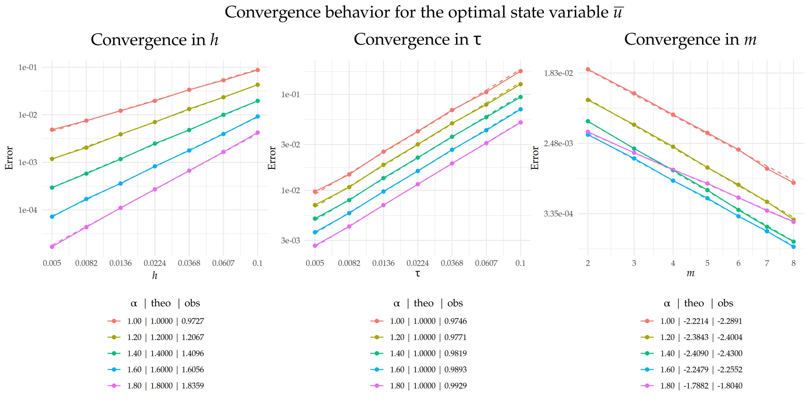
```


---

class: left, top

<div style="position:absolute; top:40px; right:55px;">
  
  
  
</div>

### Convergence behavior | 2
*********


```{r, echo = FALSE, fig.align='center', out.width='75%', fig.cap = captioner("Comparison between theoretical and observed convergence behavior for the error $\\|\\bar{z}- \\bar{\\mathcal{Z}}_{h,m}^\\tau\\|_{L_2(\\Gamma\\times(0,T))}$.")}
# figures
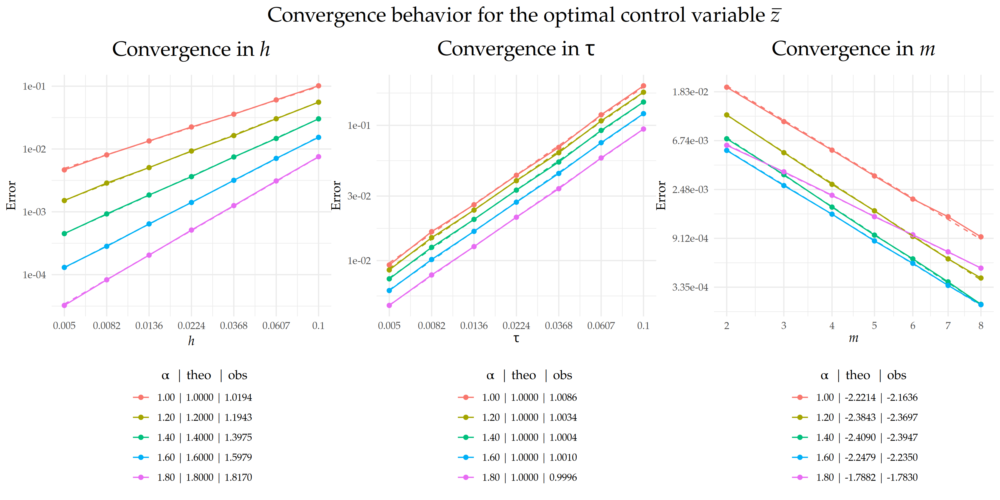
```


---

class: center, middle

<div style="position:absolute; top:40px; right:55px;">
  
  
  
</div>


## Project 4

*********

# An exponentially convergent Markov approximation of Gaussian Whittle-Matérn fields with arbitrary smoothness on metric graphs

*********


---

class: left, top

<div style="position:absolute; top:40px; right:55px;">
  
  
  
</div>

### Project 4 | Bridge representation
*********


```
{r, eval =TRUE, fig.height = 1.55, out.width = "100%", fig.cap = captioner("Animation.")}
load(here::here("data_files/p_bridge.RData"))
p_bridge
```


---

class: left, top

<div style="position:absolute; top:40px; right:55px;">
  
  
  
</div>

### Project 4 | Boundaryless representation
*********


```
{r, eval =TRUE, fig.height = 1.55, out.width = "100%", fig.cap = captioner("Animation.")}
load(here::here("data_files/p_boundaryless.RData"))
p_boundaryless
```


---

class: left, top

<div style="position:absolute; top:40px; right:55px;">
  
  
  
</div>

### More information
*********

```{r, echo = FALSE, eval = FALSE}
library(qrcode)
# Generate QR code
myqrcode <- qr_code("https://leninrafaelrierasegura.github.io/PhD_thesis/index.html") 

png(here::here("data_files/qrcode.png"), width = 800, height = 800)
plot(myqrcode)
dev.off()
```


```{r, echo = FALSE, eval = TRUE, fig.align='center', out.width='40%', fig.cap = captioner("Visit https://leninrafaelrierasegura.github.io/PhD_thesis/index.html for more information.")}
# figures
knitr::include_graphics(here::here("data_files/qrcode.png"))
```

---


class: left, top

<div style="position:absolute; top:40px; right:55px;">
  
  
  
</div>

### References
*********

```{r refs, echo=FALSE, results="asis"}
PrintBibliography(myBib, .opts = list(bib.style = "alphabetic"))
```


---

class: left, top

<div style="position:absolute; top:40px; right:55px;">
  
  
  
</div>

### Thanks
*********


```{r, eval =TRUE, fig.align='center', out.width = "45%", fig.cap = captioner("THANK-YOU-FOR-YOUR-ATTENTION graph.")}
# figures
knitr::include_graphics("data_files/thanksall3d.png")
```

