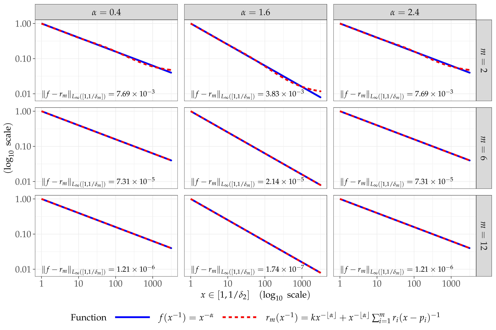

---

class: left, top

<div style="position:absolute; top:40px; right:55px;">
  
  
  
</div>

### Preliminaries | The rational approximation | Illustration
*********


```{r, echo = FALSE, fig.align='center', out.width='65%', fig.cap = captioner("Illustration of the rational approximatio of $x^{-\\alpha}$.")}

```


<!-- THIS IS THE START OF THE TEMPLATE -->
<!-- ######################################## -->
<!-- ######################################## -->
---

class: left, top

<div style="position:absolute; top:40px; right:55px;">
  
  
  
</div>

### Title template
*********

# level 1
## level 2
### level 3
#### level 4

<!-- ######################################## -->
<!-- ######################################## -->
<!-- THIS IS THE END OF THE TEMPLATE -->